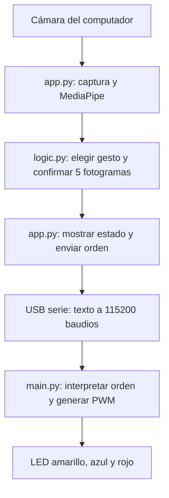
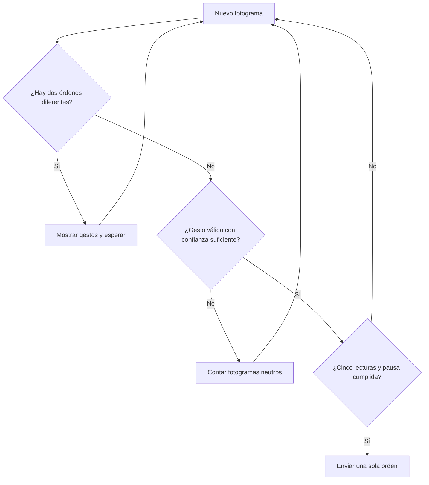
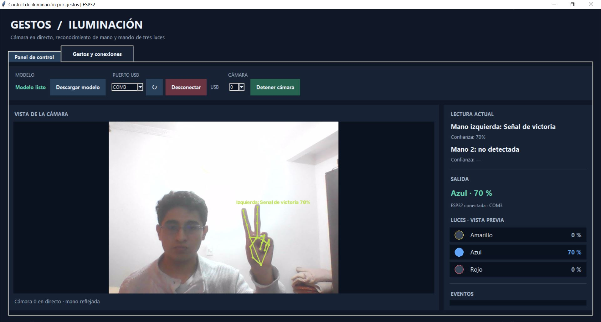
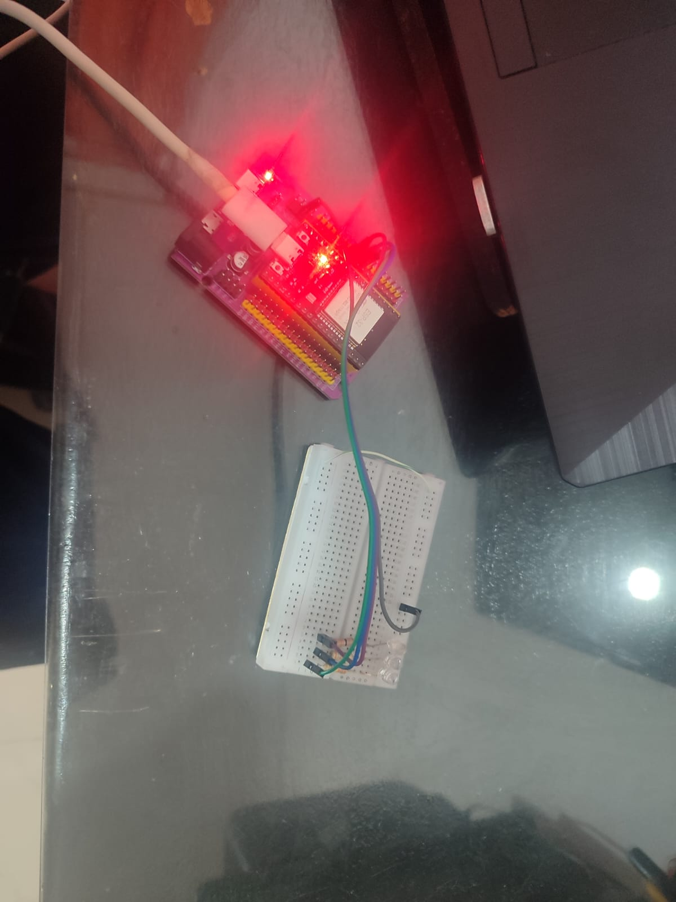
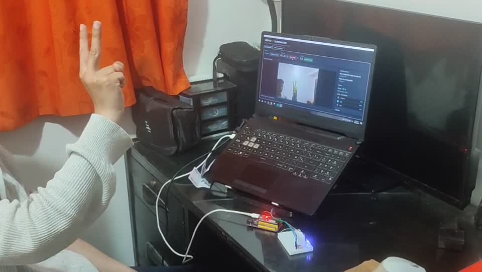

# Tarea 4 · Control de luces mediante gestos

**Autor:** Juan Felipe Romero González

En esta práctica utilicé la cámara del computador para controlar tres LED conectados a una ESP32. La ventana enseña la imagen en directo, dibuja los puntos de la mano, indica qué gesto está viendo y muestra el estado de las luces. El reconocimiento sucede en el PC; la ESP32 recibe una orden corta por el mismo cable USB con el que está conectada y produce las salidas eléctricas.

## Qué se desarrolló y cómo funciona

Al abrir la cámara, `app.py` carga el archivo `models/gesture_recognizer.task` y deja que MediaPipe busque hasta **dos manos**. Para cada mano se muestran sus 21 puntos, el nombre del gesto y la confianza. `logic.py` traduce los cinco gestos usados en el proyecto a las órdenes de la tabla. Una lectura aislada no cambia las luces: el gesto debe alcanzar **72 % de confianza** durante **cinco fotogramas consecutivos**. Si las dos manos presentan órdenes distintas al mismo tiempo, se muestran ambas detecciones, pero se espera a que haya una sola orden clara. Mantener la mano quieta tampoco envía la misma orden en cada fotograma.

| Gesto | Orden por USB | Efecto en la ESP32 |
| --- | --- | --- |
| Puño cerrado | `SET 30` | LED amarillo al 30 % de PWM |
| Señal de victoria | `SET 70` | LED azul al 70 % de PWM |
| Palma abierta | `SET 100` | LED rojo al 100 % de PWM |
| Pulgar abajo | `MODE 1` | Amarillo → azul → rojo → apagado, y vuelve a empezar |
| Pulgar arriba | `MODE 2` | Rojo → azul → amarillo → azul, y vuelve a empezar |

Los porcentajes representan el **ciclo de trabajo del PWM**, no una medida de brillo en lux. En la primera secuencia, amarillo, azul y rojo duran 600 ms cada uno y el apagado 300 ms. En la segunda, cada uno de los cuatro pasos dura 350 ms. Una orden nueva sustituye el estado anterior; `STOP` apaga todo. La interfaz también tiene botones para probar cada intensidad y secuencia sin necesidad de hacer un gesto. Cuando se usa un botón manual, se pausa el control por cámara hasta reactivarlo con la casilla correspondiente.

## Qué hace cada programa

`app.py` crea la ventana, abre la cámara y el puerto COM, dibuja las manos sobre la imagen y envía órdenes a **115200 baudios**. La lectura de cámara y MediaPipe se ejecuta fuera del hilo de la ventana para que los botones continúen respondiendo. Si se acumulan imágenes, se procesa la más reciente. El botón **Descargar modelo** solo hace falta si se borró el archivo `.task`; en esta entrega está incluido.

`logic.py` guarda la correspondencia entre gestos y órdenes, decide qué hacer cuando aparecen dos manos y aplica el filtro de confianza y estabilidad. También calcula los niveles de la vista previa. Esto permite mostrar el estado en pantalla aunque la ESP32 esté desconectada; en ese caso la interfaz indica que se trata de una **vista previa local**.

`esp32_gestos_luces/main.py` se guarda en la placa como `main.py`. Prepara tres salidas PWM de 5 kHz, lee líneas de texto del USB sin bloquear la ejecución y responde a `SET`, `MODE`, `STOP`, `PING` y `STATUS`. Sus secuencias avanzan con el reloj de MicroPython, así que puede atender una nueva orden durante la animación. Por ejemplo, si hago el gesto de victoria y este supera el filtro, el PC envía `SET 70`; la ESP32 deja los LED amarillo y rojo apagados, pone el azul al 70 % de PWM y devuelve su estado al computador.

## Diagrama de funcionamiento



En el diagrama se separan dos responsabilidades: **el computador reconoce la mano** y **la ESP32 genera las señales de salida**. Si no se conecta la placa, el recorrido termina en la vista previa de la ventana; por eso ver el LED dibujado en pantalla no equivale a tener un LED físico encendido.



Este segundo diagrama representa el filtro del programa. La confianza mínima es 0,72; después de enviar una orden espera 0,9 s antes de aceptar otra. Si se mantienen el mismo gesto y la misma mano, no lo repite sin más: se rearma al dejar de ver un gesto válido durante tres fotogramas o al cambiar de gesto.

## Explicación paso a paso de los códigos

### 1. `app.py`: cámara, ventana y comunicación

Al ejecutar `app.py`, la función `main()` crea la ventana de Tkinter y construye `LightingApp`. Su inicializador deja la acción en `STOP`, prepara una cola de **un solo fotograma**, otra cola de eventos, el filtro `GestureGate` y las variables que se muestran en pantalla. Después `_build()` organiza el video, los gestos de cada mano, las tres luces dibujadas, el selector COM, los controles manuales y la pestaña de conexiones. El método `_poll()` vuelve a programarse cada 50 ms para mantener la interfaz actualizada.

Cuando pulsamos **Iniciar cámara**, `toggle_camera()` comprueba que existe `models/gesture_recognizer.task`, reinicia el filtro y lanza `camera_worker()` en otro hilo. Ese trabajador abre el índice de cámara seleccionado, refleja la imagen horizontalmente y la entrega al reconocedor de MediaPipe con `num_hands=2`. Por cada fotograma dibuja los puntos y las uniones de ambas manos y envía a la cola la imagen reciente, los gestos reconocidos y una marca de tiempo. Si el análisis va más lento que la cámara, descarta la imagen vieja de la cola para evitar que la ventana muestre gestos atrasados. `_process_frame()` toma el resultado, pone el nombre y la confianza de cada mano en pantalla y consulta las reglas de `logic.py`.

El modelo está incluido en esta carpeta. `download_model()` y `model_worker()` sirven solamente para recuperarlo si falta: descargan el archivo a una ruta temporal, comprueban que tenga un formato válido y lo mueven a `models/`. Los avisos de descarga o de cámara pasan por la cola de eventos; `_poll()` los muestra sin congelar la ventana.

Para hablar con la ESP32, `refresh_ports()` enumera los COM disponibles y `toggle_serial()` abre el que se haya elegido a 115200 baudios. Abrirlo puede reiniciar la placa; por eso `_poll_serial()` no supone que esté lista de inmediato. Envía `PING` periódicamente hasta recibir `READY` o `PONG`; luego pide `STATUS` y escucha mensajes `STATE ...` o `ERR ...`. Solo cuando la comunicación está confirmada `send_action()` transmite una orden por USB terminada en salto de línea. Sin esa confirmación cambia la vista previa, pero informa que el resultado es local.

Finalmente, `_show_leds()` calcula el estado visible de cada luz y `disconnect()` intenta enviar `STOP` antes de cerrar un puerto ya confirmado. Si el usuario pulsa un botón de luz, `send_action(..., manual=True)` pausa el reconocimiento para que el siguiente fotograma no deshaga inmediatamente la orden manual. `toggle_automatic()` permite reanudarlo y reinicia el filtro.

### 2. `logic.py`: traducir y estabilizar los gestos

`GESTURE_TO_ACTION` asigna las cinco etiquetas de MediaPipe a `SET 30`, `SET 70`, `SET 100`, `MODE 1` y `MODE 2`. `read_hand_gestures()` toma el resultado del modelo y mantiene alineados, por índice, el gesto, la confianza y el lado de cada mano. `select_control_gesture()` descarta categorías no usadas y lecturas por debajo del umbral. Si hay dos gestos válidos con órdenes distintas devuelve una señal de conflicto; si coinciden, escoge la detección con mayor confianza.

`GestureGate.observe()` lleva la cuenta de fotogramas del mismo gesto. Devuelve una orden únicamente cuando ha visto cinco lecturas consecutivas válidas, se cumplió la pausa y la misma orden no está bloqueada por una mano que sigue sostenida. `reset()` limpia el estado al reiniciar la cámara o cambiar el control automático; `pause_for_conflict()` interrumpe la cuenta mientras las manos discrepan. `preview_levels()` calcula tres porcentajes en orden **amarillo, azul, rojo**; para los modos toma el tiempo transcurrido y elige la fase que corresponde. Así la animación de pantalla sigue el mismo patrón que la ESP32.

### 3. `esp32_gestos_luces/main.py`: producir las salidas

Al arrancar, `ControladorLuces.__init__()` crea tres salidas `PWM` de 5 kHz en GPIO25, GPIO26 y GPIO27, las deja apagadas y anuncia `READY`. `poner_porcentaje()` convierte cada porcentaje al rango que ofrece el firmware: 0–65535 mediante `duty_u16()`, o 0–1023 mediante `duty()` si es una versión antigua. Por ejemplo, `SET 70` equivale aproximadamente a **45 875** en el rango de 16 bits para el LED azul; amarillo y rojo quedan en cero.

`ejecutar()` vigila `sys.stdin` con `select.poll()`: recoge caracteres sin quedarse esperando por una línea completa y limita el tamaño de la orden. Al llegar el salto de línea llama a `procesar_orden()`. `PING` recibe `PONG`; `STATUS` informa el estado; `SET` fija la intensidad elegida; `MODE` inicia una secuencia; `STOP` y `SET 0` apagan. `cambiar_estado()` aplica el nuevo estado y responde `STATE ...`.

Durante `MODE 1` o `MODE 2`, `actualizar()` compara el reloj actual con el inicio de la fase y llama a `mostrar_fase()` cuando corresponde avanzar. No utiliza una espera de 600 ms que dejaría sin atender el USB; el ciclo principal duerme solo 5 ms entre comprobaciones. De esta manera un `STOP` puede sustituir una secuencia en curso. Los archivos de `tests/` verifican, sin la placa física, las reglas de dos manos, la estabilidad, las respuestas y las fases PWM.

### Un ejemplo completo

Si muestro una **palma abierta**, `camera_worker()` entrega la etiqueta `Open_Palm`. `logic.py` espera cinco fotogramas válidos y devuelve `SET 100`. `app.py` muestra **Rojo 100 %** y escribe `SET 100` seguido de un salto de línea en el puerto COM. En la placa, `procesar_orden()` cambia al estado solicitado: amarillo 0 %, azul 0 %, rojo 100 %. La respuesta `STATE SET 100` permite a la ventana confirmar el estado comunicado por la ESP32.

## Conexiones

Cada LED lleva **su propia resistencia de 330 Ω** entre el GPIO y el ánodo; su cátodo va a GND. El cable USB sirve para alimentar la placa y para la comunicación serie.

| ESP32 | Conexión | Función |
| --- | --- | --- |
| GPIO25 | 330 Ω → ánodo LED amarillo; cátodo → GND | Intensidad 30 % |
| GPIO26 | 330 Ω → ánodo LED azul; cátodo → GND | Intensidad 70 % |
| GPIO27 | 330 Ω → ánodo LED rojo; cátodo → GND | Intensidad 100 % |
| USB | Computador | Órdenes y respuestas a 115200 baudios |

## Cómo ejecutarlo

1. Con la ESP32 conectada, abre `esp32_gestos_luces/main.py` en Thonny. Selecciona el intérprete **MicroPython (ESP32)**, guarda el archivo **en el dispositivo** con el nombre `main.py` y reinicia la placa. Si aparece `READY`, el programa está esperando órdenes.
2. Cierra Thonny para liberar el puerto COM. En una terminal PowerShell abierta en esta carpeta instala las dependencias del PC y ejecuta la interfaz:

   ```powershell
   py -3.14 -m venv .venv
   .\.venv\Scripts\python.exe -m pip install -r requirements.txt
   .\.venv\Scripts\python.exe app.py
   ```

3. En la ventana selecciona el puerto de la ESP32 y pulsa **Conectar**. Después selecciona la cámara y pulsa **Iniciar cámara**. Puedes probar primero los botones de luces y luego activar el control por gestos. Si la cámara no es la de índice 0, prueba los otros índices de la lista.

La aplicación y Thonny no pueden abrir el mismo COM al mismo tiempo. Si la ventana muestra la vista previa pero no cambia los LED físicos, revisa el puerto, que `main.py` esté guardado en la placa y la polaridad de los LED. Los programas de escritorio y sus dependencias permanecen en el computador; a la ESP32 solo se copia su `main.py`.

## Evidencia

La captura de la interfaz muestra una detección de victoria y el estado azul de la vista previa. La fotografía muestra la ESP32 y el montaje de los LED. El fotograma extraído del video reúne el gesto, el computador y el circuito durante la demostración.







[Ver el video completo de la tarea 4](evidencia/demostracion.mp4)

Los archivos `requirements.txt` y `tests/` permiten reconstruir el entorno y revisar la lógica sin cambiar el programa. Las capturas, el montaje y el video originales se conservan en `evidencia/`.
