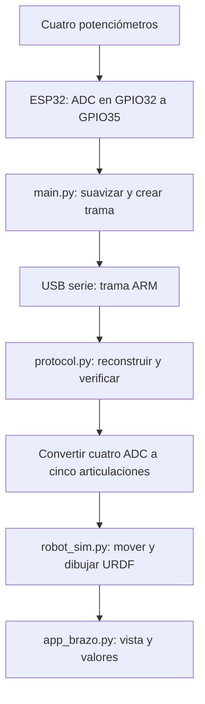
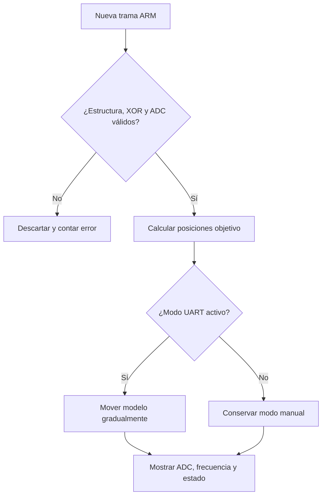
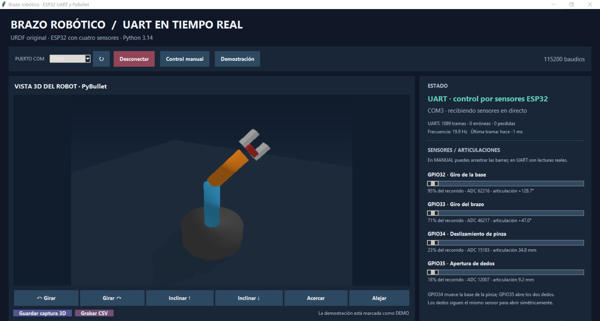
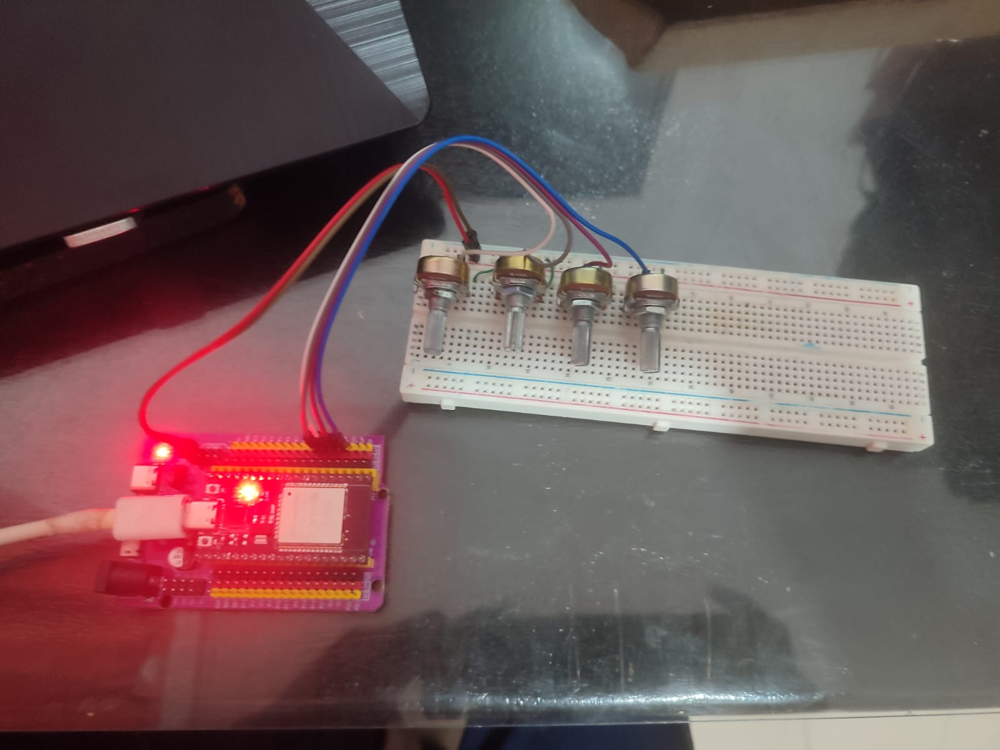
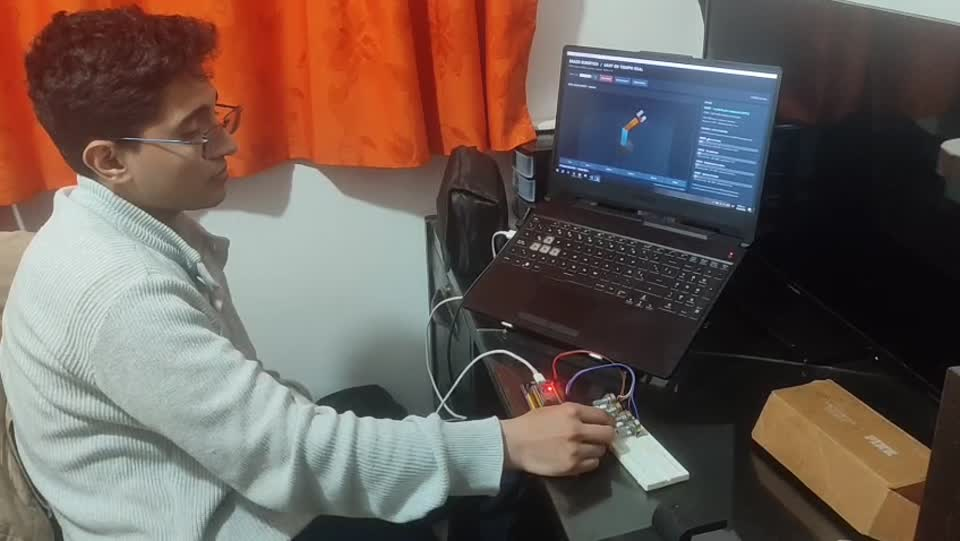

# Tarea 5 · Brazo robótico controlado desde la ESP32

**Autor:** Juan Felipe Romero González

En este trabajo conecté cuatro potenciómetros a la ESP32 para mover un brazo robótico **virtual**. La placa lee los valores, los envía por USB al computador y una interfaz de Python los convierte en posiciones de las articulaciones del modelo `brazo.urdf` dentro de PyBullet. Así se puede ver en la misma ventana la lectura de cada sensor, el estado de la comunicación y el movimiento del brazo y de la pinza.

## Recorrido de una lectura

El archivo `esp32/main.py`, que se ejecuta en MicroPython, prepara los ADC de GPIO32, GPIO33, GPIO34 y GPIO35. Cada **50 ms** toma una lectura de cada uno y aplica un suavizado para que pequeñas variaciones eléctricas no hagan temblar tanto la representación. Luego imprime una línea `@ARM` con número de secuencia, tiempo de la placa y los cuatro valores. Esas líneas viajan por la consola serie del USB a **115200 baudios**.

En el PC, `app_brazo.py` abre el COM y entrega sus bytes a `protocol.py`. Este módulo reconstruye líneas completas, comprueba que cada campo esté en rango y revisa el valor de verificación **XOR**; si una línea llega dañada no se usa para mover el robot. Las cuatro lecturas válidas se transforman en dos giros y dos movimientos de pinza. `robot_sim.py` carga el URDF en PyBullet, desplaza gradualmente sus articulaciones hacia esas posiciones y genera la imagen 3D que se ve en la interfaz.

Por ejemplo, al girar el potenciómetro de GPIO32 cambia su lectura ADC. El programa del PC la convierte en el ángulo de `joint_1`, muestra el valor en la barra **Giro de la base** y actualiza el modelo. GPIO35, en cambio, mueve **los dos dedos a la vez**: en el URDF sus ejes opuestos hacen que se abran o cierren simétricamente. La articulación llamada `joint_gripper` corresponde al **desplazamiento vertical de la pinza**, no a la separación entre sus dedos.

La ventana también ofrece **Control manual** para arrastrar las barras sin la placa y **Demostración** para recorrer el movimiento con datos generados en el PC. Estos modos están identificados dentro de la interfaz. En modo UART aparecen el número de tramas recibidas, las erróneas, las perdidas y una frecuencia aproximada; la captura de evidencia muestra el COM conectado y lecturas en directo. Se pueden guardar capturas 3D y grabar un CSV con las lecturas y posiciones.

## Diagramas del sistema



La salida física de esta tarea son **datos de sensores por USB**. El brazo que se ve en la pantalla es una simulación del archivo URDF. La ESP32 no genera señales para servomotores del brazo; envía las cuatro mediciones para que el computador actualice el modelo.



Así se entiende por qué recibir bytes por el COM no basta por sí solo: el programa necesita formar una línea correcta y comprobarla antes de usarla. Los modos **MANUAL** y **DEMO** no se presentan como lecturas físicas.

## Explicación paso a paso de cada código

### 1. `esp32/main.py`: convertir cuatro voltajes en una trama

El programa comienza con `PINS = (32, 33, 34, 35)` y `PERIOD_MS = 50`. En `main()` crea cuatro objetos `ADC`, configura la atenuación y toma una lectura inicial de cada potenciómetro. `read_adc()` usa `read_u16()` cuando está disponible; si el firmware solo ofrece `read()`, escala el resultado antiguo para trabajar con un rango comparable.

En el ciclo principal consulta `time.ticks_ms()`. Cuando corresponde transmitir, vuelve a leer los sensores y actualiza para cada canal el valor filtrado con `(3 × anterior + lectura nueva) // 4`. Esto hace que un salto de la lectura no se refleje de golpe: se mezclan tres partes del valor anterior y una del actual. `build_frame()` coloca secuencia, tiempo y cuatro ADC en una cadena, calcula el XOR de los caracteres y agrega dos dígitos hexadecimales después de `*`. Finalmente `print()` envía esa línea por la consola USB; el número de secuencia aumenta y vuelve a cero después de 65535.

No se crea un nuevo `UART(0)`: la consola USB de MicroPython ya permite que el PC lea las líneas. La periodicidad prevista es **20 tramas por segundo**: 1000 ms divididos entre 50 ms por trama.

### 2. `protocol.py`: comprobar y convertir las mediciones

`PacketStream.feed()` recibe bloques de bytes que Windows puede entregar cortados por cualquier posición. Los acumula hasta encontrar un salto de línea, ignora mensajes de arranque que no empiecen por `@ARM,` y llama a `parse_packet()`. Este comprueba el formato `@ARM,secuencia,tiempo,adc32,adc33,adc34,adc35*XX`, el XOR, la cantidad de campos y que cada ADC esté entre 0 y 65535. Una línea mala incrementa el contador de errores y no mueve el robot. Una línea correcta se convierte en `SensorPacket`.

`positions_from_adc()` divide cada lectura entre 65535 y utiliza esa fracción del recorrido de la articulación correspondiente. Las fórmulas son: `joint_1 = -2,5 + 5 × fracción32`; `joint_2 = -2 + 4 × fracción33`; `joint_gripper = 0,15 × fracción34`; y **cada dedo** `= 0,05 × fracción35`. Por ello un solo potenciómetro puede mandar dos articulaciones de dedo. Estas conversiones producen **radianes para los giros y metros para los desplazamientos**.

### 3. `robot_sim.py` y `brazo.urdf`: representar el brazo

`RobotScene.__init__()` inicia PyBullet en modo `DIRECT`, carga `brazo.urdf` y busca por nombre las cinco articulaciones que espera el programa. El URDF define la forma, los enlaces, el eje y el límite de cada una: `joint_1` gira la base, `joint_2` inclina el brazo, `joint_gripper` se desplaza en vertical, y `joint_dedo_izq` y `joint_dedo_der` separan los dedos en sentidos opuestos.

Cuando llegan nuevas posiciones, `set_targets()` las limita al recorrido del URDF y las guarda como objetivo. `advance(elapsed)` mueve el estado actual hacia el objetivo con un paso máximo por actualización; por eso un cambio brusco de potenciómetro se ve como un movimiento gradual. `render()` pide una imagen a PyBullet y la entrega a la ventana; `camera_move()` cambia ángulo, inclinación o distancia de la cámara. Esta representación actualiza posiciones de articulación, **sin simular el par de un motor físico**.

### 4. `app_brazo.py`: mostrar y registrar el resultado

`ArmApp.__init__()` carga `RobotScene`, crea los cuatro controles, prepara el receptor de tramas y construye la ventana. `refresh_ports()` encuentra los COM; `toggle_connection()` abre el elegido a 115200 baudios y pone el modo en **UART**. Cada llamada de `_tick()` lee datos con `_receive()`, actualiza la escena y dibuja la nueva imagen. Si `PacketStream` entrega una trama válida, `_apply_packet()` calcula el salto de secuencia, actualiza contadores, asigna nuevas posiciones, refresca el texto ADC y registra una fila si hay un CSV abierto.

El botón **Control manual** ejecuta `manual_mode()`: las barras de la ventana pasan a establecer las posiciones. **Demostración** ejecuta `demo_mode()`, cierra el COM y genera cuatro valores variables identificados como `DEMO`; sirve para enseñar el movimiento sin sensores. Si en modo UART no llega una trama nueva durante 1,2 s, la aplicación avisa, mientras conserva la última posición objetivo. `save_capture()` escribe una imagen en `capturas/`; `toggle_record()` crea o cierra un CSV en `registros/` con hora del PC, origen, secuencia, ADC y posiciones calculadas. `tests/` comprueba el protocolo y la correspondencia del URDF; `referencia/main_original_pybullet.py` es el ejemplo conservado, no la aplicación final.

### Ejemplo con una trama real del formato del programa

```text
@ARM,25,126530,32768,65535,1000,44000*63
```

Aquí `25` es la secuencia, `126530` es el reloj en milisegundos de la ESP32 y `63` es el XOR calculado para ese contenido. El primer ADC, **32768**, coloca la base cerca del centro de su recorrido (casi 0 rad); el segundo, **65535**, lleva `joint_2` a su límite de +2 rad; el tercero, **1000**, produce cerca de 2,29 mm de deslizamiento; y el cuarto, **44000**, abre cada dedo unos 33,57 mm. El PC valida primero `*63`, calcula esas posiciones y después mueve la escena.

## Conexiones

Cada potenciómetro se usa como divisor de tensión: un extremo a **3V3**, el otro a **GND** y el cursor al GPIO que aparece en la tabla. Los cuatro potenciómetros comparten la alimentación y la tierra de la ESP32. La placa se conecta al PC con un cable USB de datos. Las entradas ADC deben recibir tensiones dentro del rango admitido por la placa; no conectes sus cursores a 5 V.

| Cursor del potenciómetro | Control en la interfaz | Articulación | Recorrido calculado |
| --- | --- | --- | --- |
| GPIO32 | Giro de la base | `joint_1` | −2,5 a +2,5 rad |
| GPIO33 | Giro del brazo | `joint_2` | −2,0 a +2,0 rad |
| GPIO34 | Deslizamiento de pinza | `joint_gripper` | 0 a 0,15 m |
| GPIO35 | Apertura de dedos | `joint_dedo_izq` y `joint_dedo_der` | 0 a 0,05 m por dedo |

## Archivos que intervienen

`esp32/main.py` es el único archivo que se copia a la placa. `app_brazo.py` construye la ventana, recibe el puerto, actualiza los controles y permite guardar CSV y capturas; `protocol.py` comprueba las tramas y convierte ADC a posiciones; `robot_sim.py` carga y representa `brazo.urdf`. En `referencia/` se conserva el ejemplo de PyBullet recibido con el taller; la aplicación completa que se ejecuta es `app_brazo.py`. `tests/` contiene comprobaciones del protocolo y del modelo.

## Cómo ponerlo en funcionamiento

1. Abre `esp32/main.py` en Thonny, selecciona **MicroPython (ESP32)** y guárdalo en la raíz del dispositivo como `main.py`. Reinicia la placa y comprueba que en la consola aparezcan líneas que comienzan por `@ARM,`. Después cierra Thonny para que el puerto quede libre.
2. Abre PowerShell dentro de esta carpeta y ejecuta los comandos. Las dependencias de esta tarea se instalan en un entorno creado aquí, sin incluirlo en GitHub:

   ```powershell
   py -3.14 -m venv .venv
   .\.venv\Scripts\python.exe -m pip install -r requirements.txt
   .\.venv\Scripts\python.exe app_brazo.py
   ```

3. En la ventana prueba primero **Control manual** para ver el modelo. Luego selecciona el COM de la ESP32 y pulsa **Conectar ESP32**. Mueve los cuatro potenciómetros por separado: la barra, el valor ADC y la articulación correspondiente deben cambiar. Puedes girar o acercar la cámara virtual con los botones debajo de la vista.

Si el instalador de PyBullet falla en tu Windows/Python, conserva el mensaje completo de `pip` para revisar la dependencia de esa versión; el programa no puede mostrar el URDF sin PyBullet. Si el COM figura ocupado, cierra Thonny u otro monitor serie. La opción **Grabar CSV** crea un registro local en `registros/` y **Guardar captura 3D** escribe en `capturas/`; las evidencias seleccionadas para entregar ya se encuentran en `evidencia/`.

## Evidencia

La captura original enseña la interfaz en modo **UART**, con el brazo, las cuatro lecturas y las tramas recibidas. La fotografía registra los cuatro potenciómetros conectados a la placa. El fotograma siguiente procede del video donde se gira un control mientras el modelo está abierto en el computador.







[Ver el video completo de la tarea 5](evidencia/demostracion.mp4)

También se conserva [la vista 3D simulada](evidencia/vista_3d_simulada.png). Esta imagen muestra el modelo sin lectura física y se distingue de la captura del modo UART.
