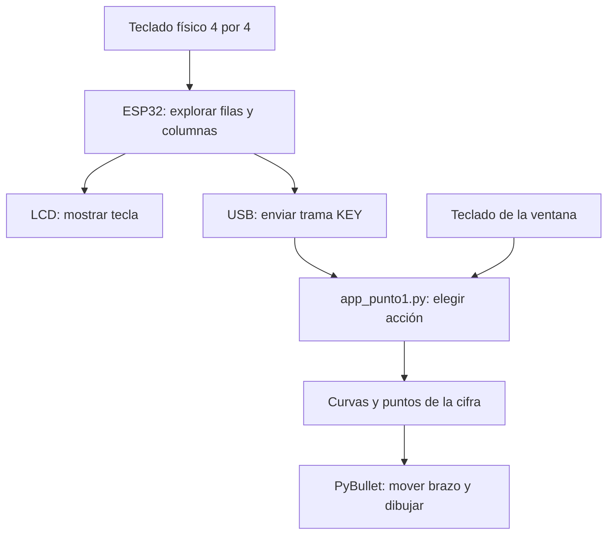
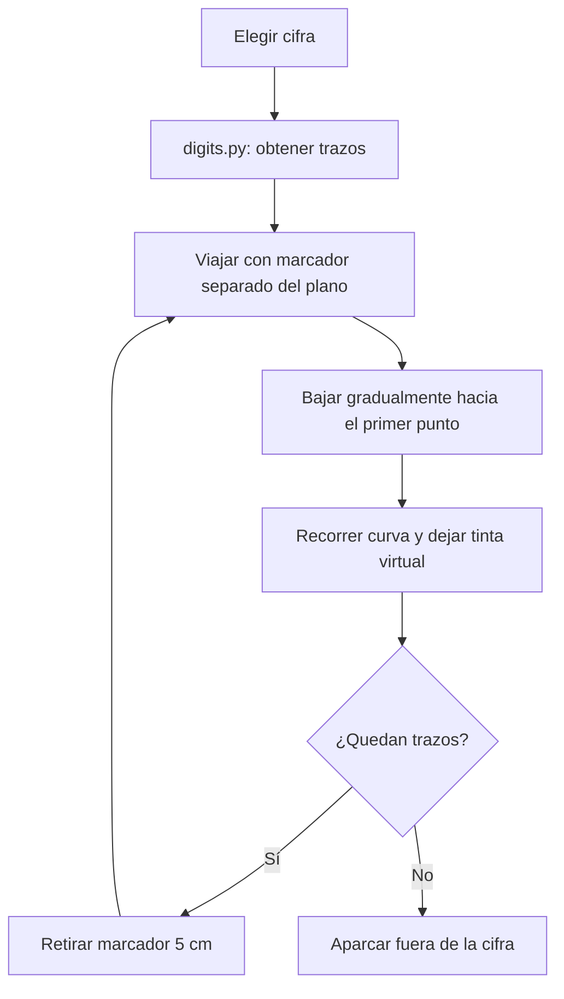
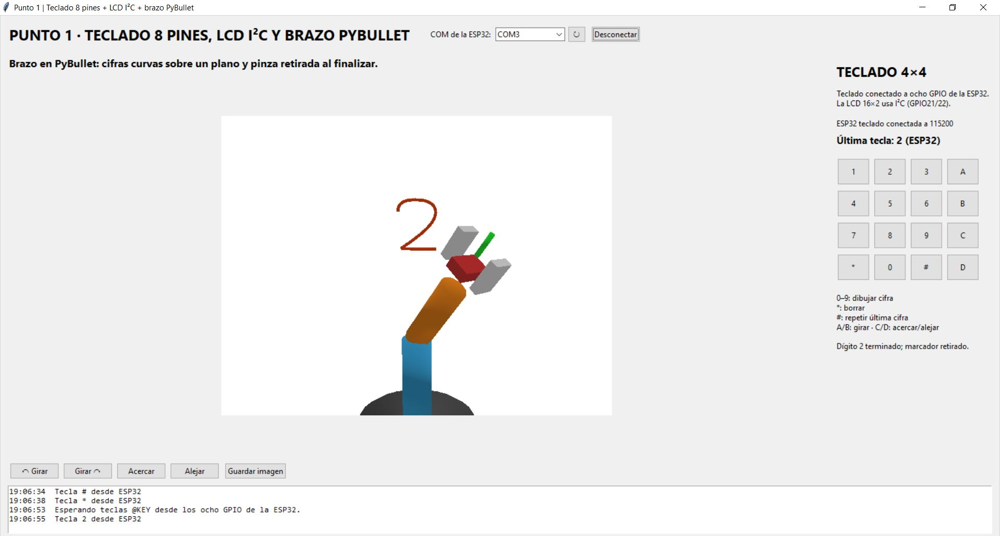
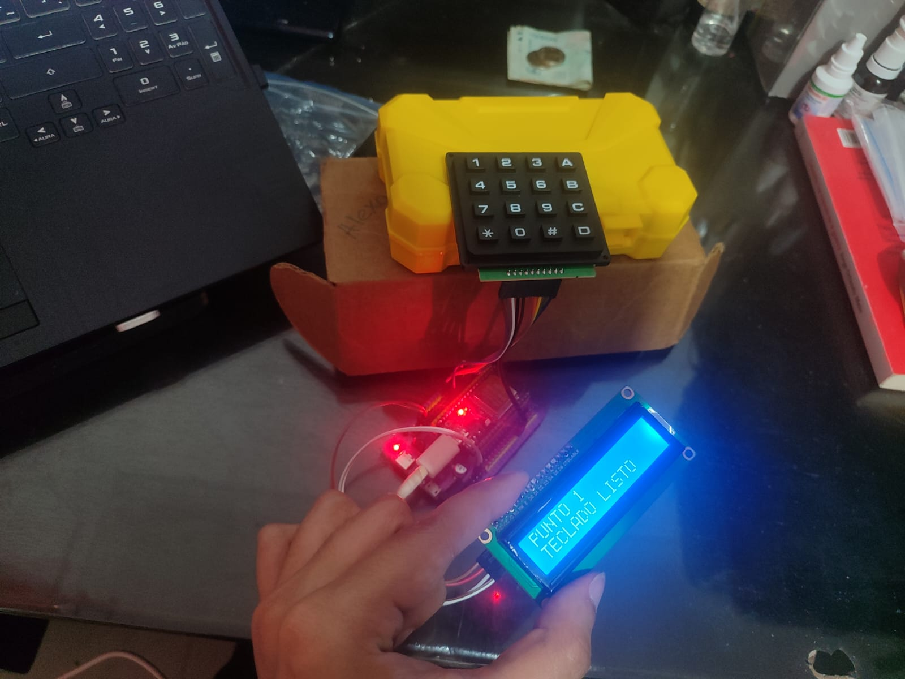
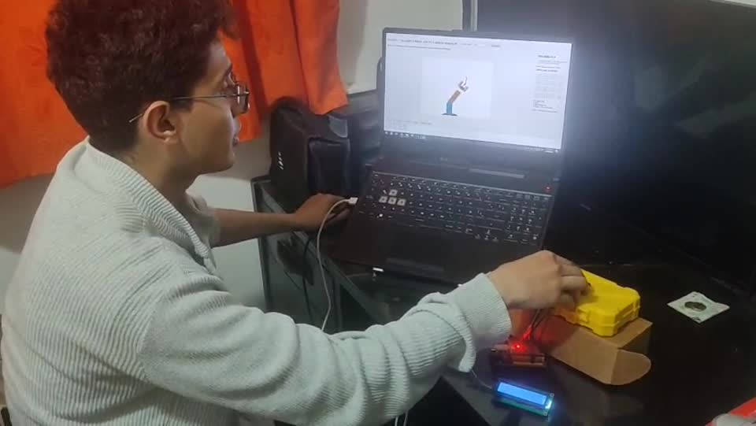

# Tarea 6 · Punto 1: teclado y brazo que dibuja números

**Autor:** Juan Felipe Romero González

En el primer punto conecté un teclado matricial 4×4 y una pantalla LCD 16×2 a una ESP32. Cuando pulso una cifra, la placa muestra la tecla en la LCD y la envía al computador. Allí una aplicación mueve el modelo de un brazo en PyBullet para **dibujar el número del 0 al 9**. La ventana incluye un teclado con los mismos botones para probar el dibujo aun cuando la ESP32 no esté conectada.

## Cómo se produce el dibujo

`esp32_teclado_directo/main.py` pone las cuatro filas del teclado como salidas y las cuatro columnas como entradas con resistencias de subida. Recorre una fila a la vez: la coloca brevemente en nivel bajo y mira qué columna se ha puesto también en bajo. La intersección indica la tecla pulsada. El programa espera **55 ms** para confirmar la pulsación y evitar lecturas repetidas por rebote. Después muestra la tecla en la LCD y envía al PC una trama `@KEY` con una pequeña comprobación XOR.

`teclado_serial.py` recibe los bytes del puerto USB, recompone una línea completa y acepta solo teclas válidas con el valor XOR correcto. `app_punto1.py` muestra la tecla y decide la acción: un dígito inicia un dibujo; `*` borra; `#` vuelve a dibujar la última cifra; `A` y `B` giran la cámara; `C` y `D` acercan o alejan la vista.

Para dibujar sin que el número quede formado por lados rígidos, `digits.py` define cada cifra mediante trazos y **curvas de Bézier**. `drawing_geometry.py` transforma esos puntos a una hoja virtual plana y calcula los valores de las articulaciones necesarios para alcanzar cada punto con la punta. `draw_robot.py` carga `brazo.urdf`, mueve el brazo por las posiciones calculadas y va dejando el trazo visible. Entre trazos, la punta se **retira 5 cm del plano**; al finalizar se mueve hacia un lado para no tapar la cifra. Por ejemplo, al pulsar `2`, la interfaz recibe `@KEY,2`, planifica los trazos curvos del dos y muestra el brazo avanzando por ellos hasta completar el dibujo.

El dibujo pertenece a la **simulación de PyBullet**; el teclado y la LCD son físicos. La aplicación también ofrece **Guardar imagen** para conservar una captura local de la vista.

## Diagramas del punto 1



El teclado físico y el teclado dibujado en la ventana llegan a la **misma función** `keypress()`. La diferencia es el origen mostrado en pantalla. La LCD refleja la pulsación del teclado físico; la figura final se dibuja solo en PyBullet.



Este recorrido explica por qué el brazo ya no arrastra una línea entre partes separadas de un número. La cifra se calcula como puntos sobre un plano y no como un movimiento libre en el espacio.

## Explicación paso a paso de todos los programas

### 1. `esp32_teclado_directo/main.py`: leer la tecla

`Keyboard.__init__()` configura R1–R4 como salidas inicialmente altas y C1–C4 como entradas con `PULL_UP`. `Keyboard.read()` pone una sola fila en bajo, espera 80 microsegundos y revisa las cuatro columnas. Cuando se pulsa una tecla, se unen esa fila y esa columna: la columna correspondiente se lee como `0`. El programa conoce el mapa `123A / 456B / 789C / *0#D` y con fila más columna obtiene el carácter. Al terminar cada fila vuelve a dejarla en alto. Si hay varias teclas simultáneas, no devuelve ninguna para evitar una lectura ambigua.

La función `main()` compara la nueva lectura con la anterior y espera **55 ms** sin cambio antes de aceptarla. Esta es la protección contra el rebote mecánico del pulsador. `send_key()` construye el contenido `KEY,tecla`, calcula con `checksum()` el XOR de sus caracteres y lo imprime como `@KEY,tecla*XX`. Solo envía la tecla **al presionarla**; mantenerla sostenida no genera una secuencia continua de dibujos.

En el mismo arranque se crea un bus `I2C(0)` con SDA=21 y SCL=22 y se buscan dispositivos. Si aparece `LCD_ADDRESS = 0x27`, `LCD16x2` inicializa la pantalla y muestra `PUNTO 1 / TECLADO LISTO`. Sus métodos `nibble()` y `command()` envían a la mochila I²C las dos mitades de cada instrucción del controlador de la LCD; `show()` escribe hasta 16 caracteres por línea y completa el espacio que sobre para borrar texto viejo. Al pulsar una tecla muestra `TECLA: ...` y `PC + PYBULLET`. Si no se encuentra la LCD, el escaneo del teclado y el USB siguen funcionando.

### 2. `teclado_serial.py`: recibir sin confundir el arranque de MicroPython

En el computador, `KeyStream.feed()` acumula fragmentos del puerto hasta ver `\\n`. Luego `decode_key()` exige el prefijo `@KEY,`, un solo carácter permitido y un XOR correcto; el resto de mensajes, como el texto de inicio de la placa, se descarta. `encode_key()` construye una trama con el mismo formato para probar el protocolo. Esto evita que un byte perdido o una palabra cualquiera se interprete como una orden para dibujar.

### 3. `app_punto1.py`: decidir qué hacer con la tecla

`App.__init__()` carga `brazo.urdf` mediante `DrawingRobot`, crea la ventana y programa `tick()` cada 50 ms. En `_build()` coloca el selector COM, la imagen de PyBullet, la botonera 4×4 y los controles de cámara. `connect()` abre el puerto elegido a 115200 baudios; dentro de `tick()` se reciben bytes, `KeyStream` obtiene teclas válidas y las pasa a `keypress(key, "ESP32")`. Los botones de la ventana llaman a `keypress(key, "Interfaz")`, por lo que ambos caminos comparten la lógica.

`keypress()` manda los dígitos a `robot.draw()`; `*` ejecuta `robot.clear()`; `#` repite `last_drawn`; y `A/B/C/D` cambian la orientación o el zoom de la cámara. `tick()` también llama a `robot.step()` para ejecutar una parte del trazo y pide imágenes nuevas a PyBullet para mostrarlas. `capture()` guarda la vista en `capturas/`. Cuando el programa se cierra, `close()` libera el COM y desconecta el motor de simulación.

### 4. `digits.py`: construir curvas que parezcan números escritos

`GLYPHS` contiene los trazos de 0 a 9. Una orden `M` fija el comienzo de un trazo, `L` describe una recta y `C` define una curva de Bézier con dos puntos de control y un punto final. `strokes(digit)` convierte estas órdenes en listas de puntos pequeños: las curvas se muestrean en 18 pasos, mientras que las rectas se dividen según su longitud. Una cifra como el **2** utiliza una curva superior, baja hacia la izquierda y termina con su base. Cuando la cifra requiere levantar el marcador, el archivo devuelve más de un trazo.

### 5. `drawing_geometry.py`: poner esos puntos en el plano y calcular articulaciones

Los trazos anteriores están en coordenadas normalizadas, de 0 a 1. `tip_target(u, v, clearance)` los lleva a una hoja virtual de **17 cm por 17 cm** situada sobre el plano `X = 0,30 m`: `u` desplaza la punta horizontalmente y `v` la mueve en altura. Cuando `clearance` es mayor que cero, la punta se aleja del plano hasta **0,05 m**. `joint_targets()` toma esa posición de punta y resuelve el giro de base, la inclinación del segundo brazo y la extensión de la pinza. Si un punto exige un alcance fuera de las articulaciones definidas, produce un error en vez de dibujar una postura imposible.

`plan_strokes()` decide la secuencia de movimientos: llega al comienzo de un trazo con la punta retirada, baja progresivamente, recorre sus puntos dejando marca, vuelve a retirar la punta y viaja hacia el siguiente. Al acabar va a `PARK`, ubicado a un costado de la cifra. Por eso el marcador no pasa encima del número ya terminado.

### 6. `draw_robot.py`: ejecutar el plan dentro de PyBullet

`DrawingRobot.__init__()` inicia PyBullet en modo `DIRECT`, carga el URDF y verifica que existan las articulaciones necesarias. Añade un pequeño cuerpo visual verde para representar el marcador. `draw()` pide los trazos de `digits.py` y llena una cola de posiciones con `plan_strokes()`. `step()` saca unos pocos puntos por llamada; `move()` calcula articulaciones, usa `resetJointState()` para colocar el modelo y actualiza la punta. Solo si `pen_down` está activo, `_ink_line()` crea el segmento naranja entre el punto anterior y el actual. `clear()` borra esos segmentos, `render()` captura la escena y `camera_move()` modifica la vista.

### Un recorrido concreto al pulsar `2`

Con R1–R4 y C1–C4 conectadas como se indica abajo, la ESP32 identifica el cruce de la tecla **2**. Después del antirrebote envía:

```text
@KEY,2*49
```

`teclado_serial.py` valida `49` como XOR de `KEY,2`. La aplicación llama a `robot.draw(2)`; `digits.py` construye la forma curva; `drawing_geometry.py` calcula los puntos del plano y la retirada del marcador; finalmente `draw_robot.py` mueve el modelo y deja el trazo. La LCD indica `TECLA: 2` y la ventana identifica si la pulsación vino de la ESP32 o del teclado gráfico.

## Conexiones

El teclado tiene **ocho cables directos** a la ESP32: cuatro filas y cuatro columnas. La LCD sí lleva una interfaz I²C. El computador se conecta a la placa mediante USB y recibe las teclas a **115200 baudios**.

| Teclado 4×4 | ESP32 | Teclado 4×4 | ESP32 |
| --- | --- | --- | --- |
| Fila R1 | GPIO14 | Columna C1 | GPIO33 |
| Fila R2 | GPIO27 | Columna C2 | GPIO32 |
| Fila R3 | GPIO26 | Columna C3 | GPIO18 |
| Fila R4 | GPIO25 | Columna C4 | GPIO19 |

| LCD 16×2 con adaptador I²C | ESP32 |
| --- | --- |
| SDA | GPIO21 |
| SCL | GPIO22 |
| VCC | Alimentación adecuada para la mochila LCD |
| GND | GND de la ESP32 |

El código busca la LCD en la dirección `0x27`; si tu adaptador tiene otra dirección debes actualizar `LCD_ADDRESS` en `main.py`. Si la mochila se alimenta a 5 V, protege los pines I²C de 3,3 V mediante adaptación de niveles. La ausencia de LCD no impide que el programa envíe teclas al PC.

## Archivos del punto 1

En el PC se ejecuta `app_punto1.py`; `digits.py`, `drawing_geometry.py`, `draw_robot.py`, `teclado_serial.py` y `brazo.urdf` son las piezas que utiliza esa misma aplicación. A la placa se copia únicamente `esp32_teclado_directo/main.py` con el nombre `main.py`. Las dependencias están en `requirements.txt`, las comprobaciones en `tests/` y la imagen entregada como referencia de la consigna en `referencia/`.

## Cómo ejecutarlo

1. En Thonny selecciona **MicroPython (ESP32)**, abre `esp32_teclado_directo/main.py` y guárdalo **en la ESP32** como `main.py`. Reinicia la placa. En la consola debe aparecer el aviso de inicio y, al pulsar una tecla, una línea `@KEY`; la LCD muestra la tecla si está conectada.
2. Cierra Thonny. Desde PowerShell, ubicado en `Punto_1`, instala y abre el programa:

   ```powershell
   py -3.14 -m venv .venv
   .\.venv\Scripts\python.exe -m pip install -r requirements.txt
   .\.venv\Scripts\python.exe app_punto1.py
   ```

3. Pulsa un número en el teclado de la ventana para comprobar el brazo. Después selecciona el puerto COM de la ESP32 y pulsa **Conectar**. Prueba la misma cifra desde el teclado físico y observa el origen **ESP32** en la interfaz. Si las teclas no coinciden, revisa el orden real de filas y columnas del conector.

La LCD de este punto y la OLED del punto 2 son pantallas diferentes: no se usa el firmware del otro punto. Para ejecutar las pruebas de código, desde esta misma carpeta se puede usar `.\.venv\Scripts\python.exe -m unittest discover -s tests -v`.

## Evidencia

La captura de la interfaz muestra una cifra **2** dibujada por el brazo y una tecla llegada desde la ESP32. La fotografía registra el teclado, la placa y la LCD. El fotograma del video muestra el montaje junto a la aplicación durante la demostración.







[Ver el video completo del punto 1](evidencia/demostracion.mp4)
