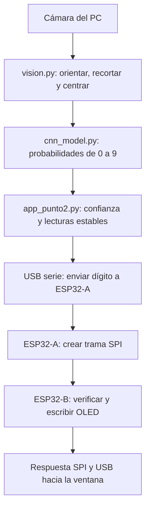
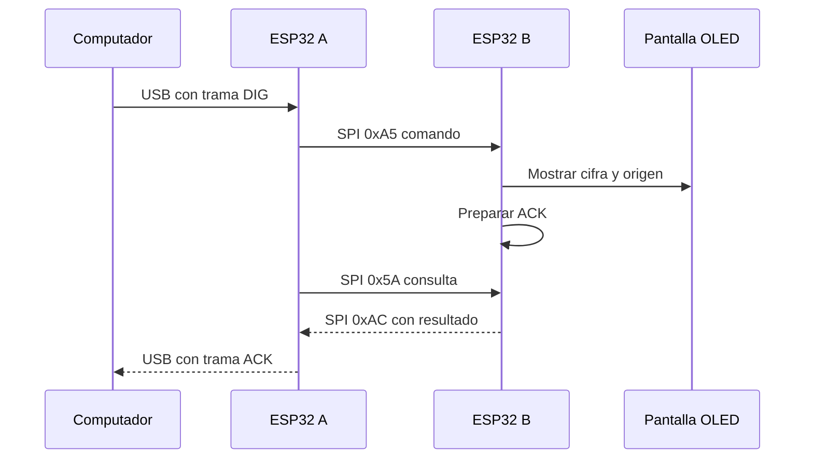
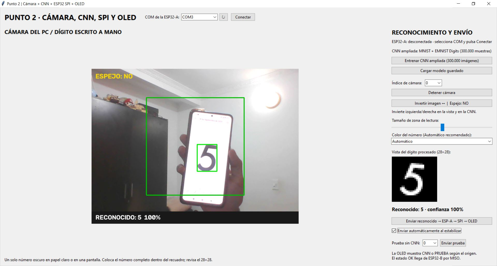
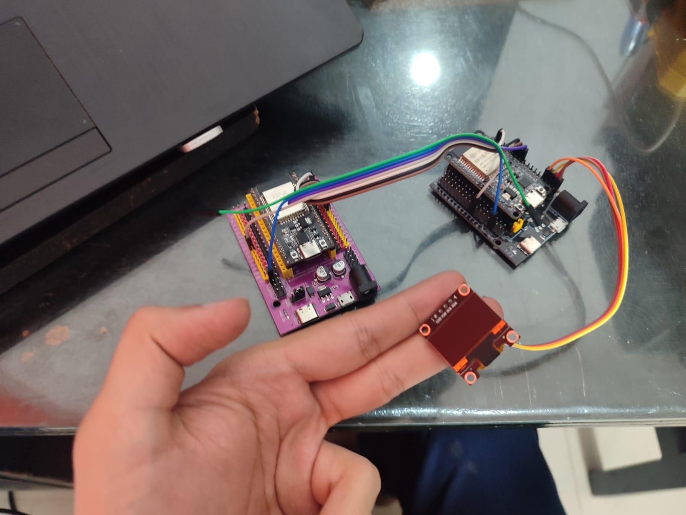
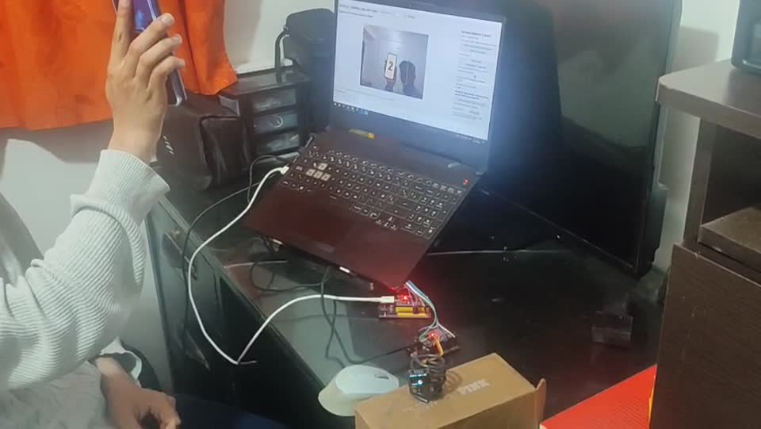

# Tarea 6 · Punto 2: reconocer un dígito y mostrarlo en una OLED

**Autor:** Juan Felipe Romero González

En este punto la cámara del computador observa un número escrito a mano. La aplicación encuentra el trazo, prepara una imagen de **28 × 28 píxeles** y una red neuronal convolucional (CNN) decide qué cifra del 0 al 9 aparece. Después el PC envía esa cifra por USB a una ESP32-A; la placa A se comunica por **SPI** con una ESP32-B, y B la muestra en una pantalla **OLED SSD1306 por I²C**. Son dos enlaces diferentes: SPI une las placas e I²C une la segunda placa con la pantalla.

## Qué ocurre desde la cámara hasta la pantalla

`app_punto2.py` crea la ventana, abre la cámara y permite elegir el puerto COM de **ESP32-A**. El botón **Invertir imagen** refleja horizontalmente tanto lo que vemos como la imagen que se analiza; sirve cuando una cifra aparece al revés en la cámara. La zona de lectura se puede ajustar y el modo inicial **Automático** intenta extraer trazos oscuros sobre papel o sobre la pantalla clara de un teléfono.

`vision.py` busca un solo trazo dentro del recuadro. Si observa una pantalla luminosa, primero delimita su interior para que el borde del teléfono no se confunda con el número. Después limpia el fondo, recorta la cifra, la centra y la transforma en un trazo claro sobre un fondo negro de 28 × 28. La interfaz enseña esa imagen pequeña al lado del video: revisarla ayuda a saber **qué está recibiendo realmente la CNN**.

`cnn_model.py` define las capas de la red y carga el archivo incluido `modelos/digitos_cnn.pt`. El archivo guardado indica que se usaron **MNIST y EMNIST Digits**. `entrenar_cnn.py` permite volver a entrenarla con unas **300 000 imágenes** de ambas bases, pero **no hace falta hacerlo para abrir esta entrega con el modelo incluido**. Los grandes conjuntos de entrenamiento descargados no están en el repositorio. Un número se considera listo para enviar cuando la predicción alcanza al menos **80 % de confianza** y se repite en **cuatro de las últimas cinco lecturas**. Si no se cumple, la ventana indica que la lectura es dudosa.

Una vez estable, se puede pulsar **Enviar reconocido** o activar **Enviar automáticamente al estabilizar**. `protocolo_spi_serial.py` construye la trama con cifra, origen y número de secuencia, y agrega una comprobación XOR. `esp32_maestra_spi/main.py` recibe esa línea por el USB de ESP32-A, espera la señal **READY** de ESP32-B y transmite **12 bytes por SPI a 200 kHz**. Envía una segunda transacción para recuperar la confirmación que B preparó después de recibir la cifra.

`esp32_esclava_oled_arduino/esp32_esclava_oled_arduino.ino` se ejecuta en ESP32-B. Comprueba el paquete, escribe el número en la OLED y devuelve `OK`, `SPI_ERR` u `OLED_ERR` hacia A. La placa A reenvía esa respuesta al PC para que la interfaz muestre qué pasó. Como ejemplo, si el sistema reconoce un **5**, se envía por USB a A, pasa por SPI a B y aparece en la pantalla marcado como **CNN**. El botón **Enviar prueba** salta el reconocimiento de cámara: manda la cifra elegida con la etiqueta **PRUEBA** para revisar la cadena de comunicación por separado.

## Diagramas de reconocimiento y comunicación



Este flujo solo llega a la OLED cuando hay una cifra estable, se pulsa **Enviar reconocido** o está habilitado el envío automático, y además la aplicación está conectada al COM de ESP32-A. Ver un número en la cámara no significa que ya se haya transmitido.



SPI envía y recibe bytes simultáneamente. Por eso la respuesta que B construye **después** del comando se recoge en una **segunda transacción**. La línea READY de B avisa a A cuando su controlador ya está preparado para cada intercambio.

## Explicación paso a paso de todos los códigos

### 1. `app_punto2.py`: coordinar cámara, modelo y puerto

Al arrancar, `App.__init__()` deja la cámara apagada, el COM desconectado, la inversión horizontal desactivada y el envío automático **desmarcado**. Reserva una cola de las últimas cinco predicciones, un número de secuencia para los mensajes y un diccionario de confirmaciones pendientes. `_build()` crea la vista de cámara, el recorte de 28 × 28, el estado de la CNN, el selector COM, el botón de espejo, el envío de un número reconocido y la prueba sin CNN.

`load_model()` abre `modelos/digitos_cnn.pt` mediante `cnn_model.py` y muestra en la ventana qué fuentes de entrenamiento declara el archivo. `toggle_camera()` abre la cámara seleccionada; si la CNN todavía no está cargada, intenta cargarla en ese momento. `toggle_mirror()` cambia el reflejo de la imagen y `reset_reading()` limpia las lecturas acumuladas: así un número detectado antes del cambio no se mezcla con los fotogramas nuevos. `train()` es una opción independiente que abre `entrenar_cnn.py` en otro proceso y recibe sus mensajes de progreso; no se necesita para usar el modelo guardado.

La función `camera_tick()` obtiene un fotograma, aplica `orient_frame()` si se activó el espejo y recorta un cuadrado central cuyo tamaño se ajusta con el control de la ventana. Entrega ese cuadrado a `process_roi()`. Si aparece un candidato, muestra su rectángulo y la imagen de 28 × 28, pasa esa imagen por la CNN y obtiene la probabilidad de cada cifra. Si la probabilidad máxima es menor de **0,80**, agrega una lectura no válida a la historia. Si la cifra elegida aparece al menos **cuatro veces entre las últimas cinco** con confianza suficiente, la presenta como **Reconocido**. El envío automático, si se activó, llama a `send_digit()` una vez por ese número estable; para poder enviarlo de nuevo hay que retirar el número del recuadro y dejar que se rearme.

`connect()` abre a 115200 baudios el COM de ESP32-A. `send_digit()` utiliza `encode_digit()` para construir la línea, aumenta la secuencia y espera una confirmación; `send_test()` marca el origen `T` y `send_recognized()` marca el origen `V`. `serial_tick()` analiza las respuestas `@ACK`, comprueba que secuencia y cifra correspondan a un envío pendiente y muestra el estado recibido de B. Si no llega confirmación en **tres segundos**, informa que falta el ACK. `tick()` reúne estas tareas periódicas y `close()` libera cámara, COM y proceso de entrenamiento.

### 2. `vision.py`: convertir una escena en un solo número

`orient_frame(frame, mirror)` invierte izquierda y derecha solo cuando se solicita. `process_roi()` convierte a grises el cuadrado central y analiza el modo de color seleccionado: `auto`, trazo `dark` u `light`. En el caso habitual de trazo oscuro sobre fondo claro, busca la diferencia entre el fondo suavizado y el trazo. Si hay una pantalla de teléfono brillante, `_bright_screen()` intenta delimitar su interior antes de umbralizar: de lo contrario el marco del teléfono o el fondo oscuro podrían parecer un número.

`_candidate()` examina los contornos y rechaza manchas demasiado pequeñas, grandes o alejadas del centro. De los candidatos que quedan se elige el que representa mejor una cifra aislada. Se recorta ese contorno, se reduce conservando proporciones hasta caber en unos **20 píxeles**, se sitúa en un lienzo negro de **28 × 28** y se centra según sus momentos. `process_roi()` devuelve tres elementos: la matriz normalizada de 0 a 1 para la CNN, el rectángulo donde apareció la cifra y una imagen pequeña para mostrar al usuario. Si no encuentra un dígito adecuado, devuelve `None`; por eso la vista de 28 × 28 es la mejor comprobación visual de lo que realmente se clasificará.

### 3. `cnn_model.py`: convertir los 28 × 28 en diez resultados

`DigitCNN` recibe una imagen de un canal. Primero aplica una convolución que produce **32 mapas**, una activación ReLU y una reducción espacial; luego otra convolución de **64 mapas** y otra reducción. El resultado de 7 × 7 por 64 se aplana, pasa por una capa de 128 valores y termina en **diez salidas**, una por cada número de 0 a 9. `forward()` define ese recorrido; la aplicación aplica `softmax` a las diez salidas para mostrar una confianza relativa. `load_model()` verifica el formato `digit_cnn_v1`, carga los pesos guardados y pone la red en modo de evaluación.

### 4. `entrenar_cnn.py` y `orientacion_emnist.py`: cómo se obtuvo el modelo

Esta parte es **opcional al ejecutar** porque el archivo `.pt` está incluido. Si se decide entrenar de nuevo, `entrenar_cnn.py` descarga MNIST y EMNIST Digits en `datos_mnist/`, combina 60 000 y 240 000 imágenes de entrenamiento y aplica pequeñas variaciones de rotación, posición, tamaño e inclinación. `orientacion_emnist.upright()` transpone las imágenes EMNIST para darles la orientación esperada por la red. En cada época el programa calcula la pérdida y evalúa por separado los conjuntos de prueba de ambas bases. Conserva los pesos de la época con mejor promedio y guarda en `modelos/digitos_cnn.pt` las fuentes, el tamaño de entrenamiento, la época y los resultados. La precisión sobre esas bases de prueba no es una medida automática de aciertos con la cámara del montaje.

### 5. `protocolo_spi_serial.py`: dar formato y comprobar los mensajes

`encode_digit()` crea una línea `@DIG,secuencia,cifra,origen*XOR` para el USB. El origen es `V` si vino de visión y `T` si fue la prueba manual. `AckStream.feed()` recompone respuestas USB aunque lleguen por fragmentos y `decode_ack()` valida estructura, secuencia, dígito, estado y XOR. Por separado, `spi_frame()` genera **12 bytes** para enviar al esclavo: marcador, dos bytes de secuencia, carácter de la cifra, carácter de origen, XOR y relleno. Los marcadores son `0xA5` para comando, `0x5A` para consultar y `0xAC` para la respuesta; `decode_spi_ack()` conoce ese mismo formato. Este archivo permite que PC y placas hablen el mismo protocolo.

### 6. `esp32_maestra_spi/main.py`: puente entre USB y SPI

La clase `Master` prepara CS en GPIO5, READY como entrada en GPIO27 y SPI en GPIO18/23/19 a **200 kHz**. `serial_step()` lee la consola USB sin bloquear, acumula hasta el salto de línea y pasa la orden a `handle_line()`. Esta última rechaza líneas largas, XOR incorrecto, cifras fuera de 0–9 u orígenes distintos de `V` y `T`. Una orden válida llega a `send_digit()`.

`exchange()` espera a que READY indique que B preparó una transacción, baja CS, intercambia 12 bytes y vuelve a subir CS. `send_digit()` hace un intercambio de comando `0xA5` y otro de consulta `0x5A`; después comprueba que el ACK corresponda a la misma cifra y secuencia. `send_ack()` imprime el estado por USB de regreso al PC. Si falla el cableado, READY o la respuesta, la placa comunica `SPI_ERR`.

### 7. `esp32_esclava_oled_arduino.ino`: recibir y presentar la cifra

`setup()` inicia el monitor serie, el bus I²C en GPIO21/22 y busca la OLED en `0x3C` o `0x3D`. También configura la ESP32-B como **esclava SPI**. Las funciones de retorno de la transacción suben READY cuando B está preparada y lo bajan cuando termina; A no tiene que adivinar cuándo transmitir.

En `loop()`, B prepara en `tx_buffer` la respuesta anterior y espera los 12 bytes de A. Si llega el marcador `0x5A`, ya devolvió por MISO la confirmación y no vuelve a escribir el número. Si llega `0xA5`, comprueba XOR, cifra y origen; para una secuencia nueva `show_digit()` limpia la pantalla y escribe el número con **CNN** o **PRUEBA**. `set_ack()` guarda `OK`, `SPI_ERR` u `OLED_ERR` para la siguiente transacción. El propio código de Arduino queda en B; no se copia a ESP32-A ni se ejecuta en Python.

### Ejemplo completo de una cifra `5`

Supongamos que cuatro de las últimas cinco lecturas válidas reconocen el **5** con al menos 80 %. Cuando se pulsa **Enviar reconocido**, el PC puede enviar esta línea para la secuencia 7:

```text
@DIG,7,5,V*32
```

La ESP32-A valida `*32`, envía a B el comando SPI con `5` y origen `V`, consulta el ACK y regresa al PC una línea como `@ACK,7,5,OK*63` si B lo recibió y la OLED funcionó. La ventana solo presenta la confirmación al comprobar que corresponde a la misma secuencia y cifra. Si el reconocimiento se ve en pantalla pero no hay COM conectado, **este recorrido se detiene antes del USB**.

## Conexiones de las dos placas

Conecta ESP32-A al computador mediante USB. ESP32-B puede alimentarse con su propio cable USB. Une las tierras y las señales de la tabla con cables cortos; no unas entre sí las salidas de 5 V de ambos USB.

| ESP32-A · maestra MicroPython | ESP32-B · esclava Arduino | Señal |
| --- | --- | --- |
| GPIO18 | GPIO18 | SCK, reloj SPI |
| GPIO23 | GPIO23 | MOSI, datos A → B |
| GPIO19 | GPIO19 | MISO, respuesta B → A |
| GPIO5 | GPIO5 | CS, selección de B |
| GPIO27, entrada | GPIO27, salida | READY |
| GND | GND | Referencia común |

La pantalla de **cuatro pines** se conecta **solo a ESP32-B**:

| OLED SSD1306 I²C | ESP32-B |
| --- | --- |
| VCC | 3V3 |
| GND | GND |
| SDA | GPIO21 |
| SCL | GPIO22 |

El firmware de B prueba las direcciones I²C `0x3C` y `0x3D`. Al arrancar, la OLED debe mostrar un guion antes de recibir una cifra. Si no aparece, revisa alimentación, SDA y SCL. El monitor serie de B puede indicar si la pantalla no se encontró. No confundas el conector I²C de la OLED con los cuatro hilos de SPI que van entre las ESP32.

## Cargar los programas

1. **ESP32-B:** abre el archivo `.ino` de `esp32_esclava_oled_arduino/` en Arduino IDE. Selecciona tu placa ESP32 con el core de Espressif para Arduino y ten instaladas las bibliotecas **Adafruit SSD1306**, **Adafruit GFX** y **Adafruit BusIO**. Sube el programa a B; esta placa necesita funcionar como **esclava SPI**.
2. **ESP32-A:** en Thonny con MicroPython abre `esp32_maestra_spi/main.py` y guárdalo **en A** como `main.py`. Reinicia la placa y luego cierra Thonny para liberar su puerto COM.
3. En PowerShell, dentro de `Punto_2`, crea el entorno del PC y abre la interfaz:

   ```powershell
   py -3.14 -m venv .venv
   .\.venv\Scripts\python.exe -m pip install -r requirements.txt
   .\.venv\Scripts\python.exe app_punto2.py
   ```

4. Enciende B, comprueba el guion en la OLED y conecta A en la interfaz. Usa primero **Enviar prueba**: el número escogido debe llegar a B con la etiqueta **PRUEBA** y la aplicación debe mostrar la respuesta. Después pulsa **Cargar modelo guardado**, inicia la cámara, centra una cifra, comprueba la vista de 28 × 28 y envíala cuando diga **Reconocido**. La inversión de imagen se activa solo si la cifra se ve reflejada.

La captura de la interfaz incluida en `evidencia/` muestra una predicción **5**, pero en ese instante la **ESP32-A aparece desconectada**: esa imagen documenta el reconocimiento visual y **por sí sola no demuestra el envío a la OLED**. El video y la fotografía del montaje son evidencias adicionales de la práctica; para afirmar una recepción concreta debe verse la confirmación `OK` y el número en la pantalla. Esta distinción evita confundir una predicción de la CNN con una transferencia completada.

## Evidencia

Se conservan la captura de la interfaz, la fotografía de las dos placas con la OLED y el video del ejercicio. El fotograma extraído del video permite ubicar el montaje y la aplicación en una misma escena.







[Ver el video completo del punto 2](evidencia/demostracion.mp4)

`tests/` contiene pruebas del procesamiento y del protocolo. `referencia/` guarda el material de partida del docente, mientras que los programas descritos arriba son los que forman esta solución.
