# Tarea 7 · Enjambre ACO con tres ESP32 y gemelo digital en PyBullet

**Juan Felipe Romero González** · Ingeniería Mecatrónica · Universidad Militar Nueva Granada

[Volver al índice del segundo corte](../README.md)

En esta tarea desarrollé la modalidad de **tres nodos ESP32**. Cada placa ejecuta su propio algoritmo de optimización por colonia de hormigas, conocido como ACO, para encontrar una ruta desde A hasta G. Las placas comparten aportes de feromona mediante WiFi y el computador recibe sus estados para representar tres robots virtuales en PyBullet. El simulador se ejecuta en Docker y el panel se abre en el navegador.

El montaje utiliza tres placas reales, pero sus posiciones son **avances lógicos calculados por software**. No hay motores, encoders ni sensores de posición conectados. La llegada en pantalla significa que el agente completó su ruta programada; no demuestra que un carrito físico recorrió el laberinto.

Incluí **seis imágenes originales**, los CSV del montaje y una prueba local separada. **No hay video de esta tarea.** En el ensayo V3, los tres nodos alcanzaron 40 pasos y el panel registró **2 de 3 rutas distintas**. La prueba local sin placas obtuvo tres rutas distintas; ambos resultados se explican por separado.

## Índice

- [1. Enunciado y alcance](#1-enunciado-y-alcance)
- [2. Objetivos y requisitos verificables](#2-objetivos-y-requisitos-verificables)
- [3. Arquitectura y conexiones](#3-arquitectura-y-conexiones)
- [4. Mapa, ACO y parámetros](#4-mapa-aco-y-parámetros)
- [5. Comunicación y confirmación de órdenes](#5-comunicación-y-confirmación-de-órdenes)
- [6. Estados del sistema](#6-estados-del-sistema)
- [7. Estructura de la tarea](#7-estructura-de-la-tarea)
- [8. Código de las ESP32 explicado paso a paso](#8-código-de-las-esp32-explicado-paso-a-paso)
- [9. Código del computador explicado paso a paso](#9-código-del-computador-explicado-paso-a-paso)
- [10. Un ensayo completo, desde Iniciar hasta el CSV](#10-un-ensayo-completo-desde-iniciar-hasta-el-csv)
- [11. Programación y ejecución desde la terminal](#11-programación-y-ejecución-desde-la-terminal)
- [12. Datos guardados y comportamiento al reiniciar](#12-datos-guardados-y-comportamiento-al-reiniciar)
- [13. Resultados y análisis de las gráficas](#13-resultados-y-análisis-de-las-gráficas)
- [14. Evidencias en imágenes](#14-evidencias-en-imágenes)
- [15. Problemas frecuentes y diagnóstico](#15-problemas-frecuentes-y-diagnóstico)
- [16. Pruebas de software y límites de la verificación](#16-pruebas-de-software-y-límites-de-la-verificación)
- [17. Conclusiones y mejoras pendientes](#17-conclusiones-y-mejoras-pendientes)

## 1. Enunciado y alcance

La actividad pide que tres carritos físicos **o nodos ESP32** encuentren una ruta óptima en un laberinto o almacén, ejecuten ACO dentro de cada ESP32, intercambien feromonas por red y reflejen sus resultados en tres robots virtuales de PyBullet. La parte virtual debe ejecutarse en Docker. Esta es la referencia original:

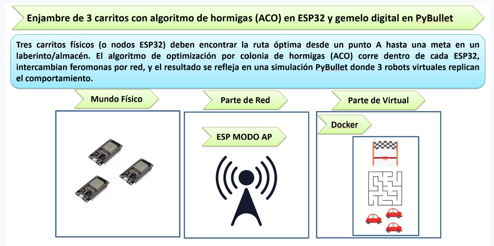

Elegí la opción de nodos porque permite comprobar la ejecución distribuida en placas y su comunicación sin construir tres vehículos. El nodo 1 crea la red y también ejecuta ACO; los nodos 2 y 3 se conectan a esa red y ejecutan sus propias colonias. El computador visualiza y verifica, mientras las placas construyen y seleccionan las rutas.

El mapa está cargado previamente. No se descubre con sensores ni se modifica ante obstáculos nuevos. El costo es el número de conexiones entre celdas; no incluye consumo eléctrico, giros o tráfico. La escala de 0,50 m por celda pertenece al modelo virtual.

## 2. Objetivos y requisitos verificables

### Objetivo general

Implementar un sistema de tres ESP32 que busque rutas de bajo costo mediante ACO, comparta aportes entre nodos y permita observar, comparar y registrar los resultados en un gemelo digital PyBullet ejecutado en Docker.

### Objetivos específicos

| Objetivo | Qué quiero comprobar | Prueba y criterio |
| --- | --- | --- |
| O1. Ejecutar ACO en cada placa | Cada nodo construye candidatas y mantiene feromona propia | Completar 160 iteraciones y comprobar 1280 candidatas y `Colony.iterate()` en cada placa |
| O2. Crear una red sin router externo | El AP comunica las placas y el computador | Revisar IP en Thonny y panel con 3/3 nodos recientes |
| O3. Compartir soluciones | Los aportes llegan y no se duplican al recibirlos | Revisar contadores y prueba de duplicados y ensayo anterior |
| O4. Encontrar rutas de bajo costo | Las rutas cumplen el mapa y alcanzan su mínimo cuando la búsqueda lo encuentra | Validar conexiones y comparar con 40 pasos de BFS |
| O5. Representar el avance | Cada robot reproduce la ruta y el progreso recibido | Observar PyBullet y validar posición compatible con la ruta |
| O6. Controlar y registrar | Pausa, reanudación y reinicio tienen efectos definidos | ACK de nodos, conservación al pausar y exportación de CSV |
| O7. Explorar alternativas | La elección considera rutas de otros nodos | Archivo de hasta 12 rutas y contador real de rutas distintas; tres diferentes no es un resultado garantizado |

### Requisitos, implementación y evidencia

Las fotografías muestran estados concretos; las pruebas automáticas comprueban casos de software. Un resultado de pruebas locales no se presenta como una medición física.

| Requisito | Implementación | Escenario | Evidencia | Resultado y alcance |
| --- | --- | --- | --- | --- |
| Tres ESP32 | `nodo1/config.py`, `nodo2/config.py`, `nodo3/config.py`, `main.run()` | Encender y abrir panel | [Montaje](evidencias/5.jpeg), [inicio](evidencias/1.JPG) | Tres placas visibles; panel con 3/3 nodos |
| ACO dentro de cada placa | `Colony.construct()`, `iterate()` y `Agent.advance()` | Completar búsqueda | [Llegada](evidencias/3.JPG), [CSV V3](data/telemetria_multirruta_v3.csv) | 160 iteraciones y 1280 candidatas por nodo |
| Red AP | `setup_wifi()` y `Transport` | Registrar clientes y PC | [Panel 3/3](evidencias/1.JPG) | Estados de tres nodos; la captura no muestra la configuración WiFi |
| Intercambio de feromona | `share_path()`, `receive_pheromone()` y `_fanout()` | Buscar simultáneamente | [Contadores](evidencias/3.JPG), CSV V3 | 40 envíos por nodo; 75, 78 y 77 recepciones |
| Rutas válidas y mínimo | `valid_path()`, `minimum_steps()`, `TelemetryStore.accept()` | Comparar A con G | [Mapa y resultados](evidencias/4.JPG) | 40 pasos por nodo, igual al mínimo del grafo |
| Caminos alternativos | `archive`, `alternatives()`, `select_route()` | Elegir después de buscar | [Mapa](evidencias/4.JPG), [prueba local](docs/resultados_prueba_local.json) | Montaje: 2 rutas distintas; prueba local: 3 |
| Tres robots virtuales | `Scene._build()`, `_car()`, `update()` | Representar estados recibidos | [Escena](evidencias/3.JPG) | Avance lógico representado; no movimiento físico |
| Parte virtual en Docker | `Dockerfile`, `compose.yaml`, `simulador.app` | Abrir puerto 18080 | [Panel](evidencias/1.JPG), archivos Docker | Panel en puerto publicado; no se adjuntó captura de Docker Desktop |
| Pausa y reinicio | `Bridge.issue()`, `Agent.on_packet()` | Congelar y continuar | `test_pause_reset_and_reordered_controls` y prueba de pausa en selección | Verificación de software; sin secuencia fotográfica de pausa |
| Recuperar control perdido | Reintentos en `Bridge.run()` y ACK | Perder comando o conectar tarde | `test_lost_command_retry_and_late_node` | Prueba UDP local, no ensayo de pérdidas del WiFi físico |
| Guardar telemetría | `TelemetryStore.accept()` y `export()` | Registrar ensayo | [CSV V3](data/telemetria_multirruta_v3.csv) | 7982 filas, incluidas reposo y llegada; no son 7982 rutas |

## 3. Arquitectura y conexiones

### Recorrido de los datos

El nodo 1 combina búsqueda y reenvío. La red concentra la comunicación en el AP, pero el trabajo de optimización se ejecuta por separado en las tres placas.

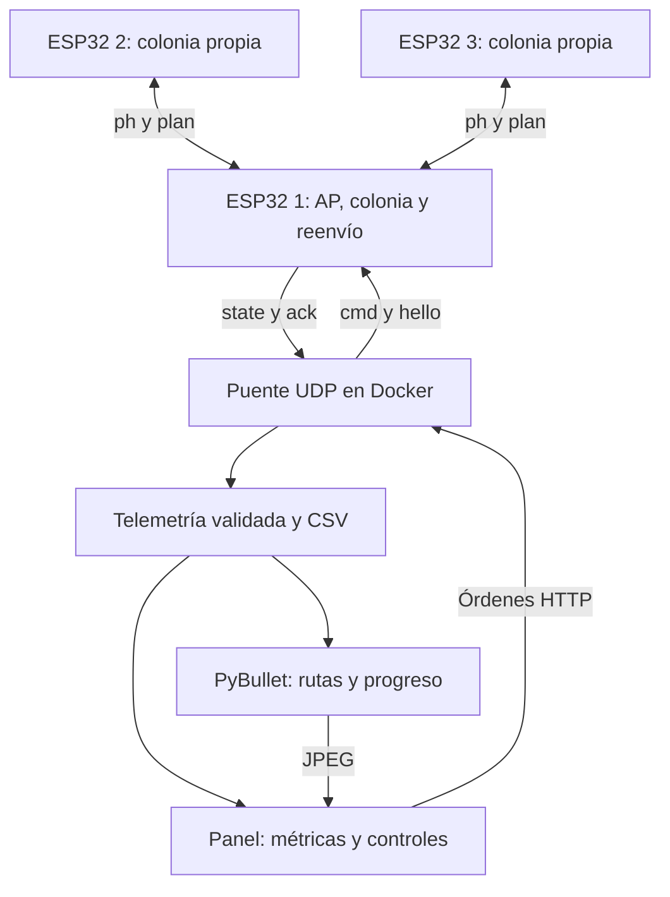

| Equipo | Papel | Dirección o puerto |
| --- | --- | --- |
| ESP32 1 | AP, ACO y concentrador UDP | `192.168.4.1:4210/UDP` |
| ESP32 2 y 3 | Clientes WiFi con ACO | IP entregada por AP; escuchan `4210/UDP` |
| Computador | Cliente del AP y anfitrión Docker | Telemetría publicada en `4211/UDP` |
| Contenedor `gemelo` | UDP, HTTP y PyBullet DIRECT | `4211/UDP`, `8080/TCP` internos |
| Navegador | Panel Docker | `http://127.0.0.1:18080` |
| Python directo | Alternativa de diagnóstico | `http://127.0.0.1:8080` |

La red se llama **ENJAMBRE_ACO**; la contraseña de laboratorio definida en los `config.py` es **Hormigas2026**. `192.168.4.1` es la ESP32 AP; `127.0.0.1` es el computador. El navegador se comunica con Docker, no con un servidor web de la placa.

### Conexiones físicas

| Elemento | Conexión | Finalidad |
| --- | --- | --- |
| ESP32 1, 2 y 3 | Cada placa alimentada por USB | Alimentar y, con cable de datos, programar |
| Computador | WiFi conectado al AP del nodo 1 | Control y telemetría |
| GPIO externos | Ninguno necesario | No hay sensores, motores, SPI o UART entre placas |
| LED opcional | `LED_PIN = None` | Salida desactivada en la configuración entregada |

No hay que unir los GPIO o GND de las placas para esta comunicación: los datos viajan por WiFi. Los cables USB visibles alimentan y permiten programar. El ensayo no usa COM para transportar las rutas. Los LED rojos de la fotografía pueden indicar alimentación; su encendido no demuestra ejecución de ACO. Se comprueba con estados y contadores.

## 4. Mapa, ACO y parámetros

### Representación del almacén

[`firmware/world.py`](firmware/world.py) guarda 21 columnas y 17 filas. `#` es muro, `A` salida y `G` meta. Una celda libre es un vértice; una conexión horizontal o vertical es una arista. No hay movimientos diagonales.

| Propiedad V3 | Valor | Origen |
| --- | ---:| --- |
| Identificador | `almacen-21x17-multirruta-v3` | `MAP_ID` |
| Salida | `(1,1)`, ID 22 | Celda A |
| Meta | `(19,15)`, ID 334 | Celda G |
| Celdas libres | 181 | `FREE_CELLS` |
| Aristas no dirigidas | 203 | `EDGES` |
| Cruces de tres o cuatro salidas | 42 | `maze_metrics()` |
| Callejones de una salida | 9 | Grados de vecinos |
| Ciclos independientes | 22 | `203 - 181 + 1` en grafo conectado |
| Mínimo | 40 pasos | BFS del computador |
| Rutas mínimas diferentes | 23 | Conteo y prueba de enumeración |
| Escala del modelo | 0,50 m por celda | `CELL_METERS` |

El ID es `y * 21 + x`. Para recuperarlo se usa `x = id % 21`, `y = id // 21`. Una ruta mínima contiene **41 IDs y 40 aristas**: `len(path)-1` es su costo. La escala da `40 * 0.50 = 20 m` ilustrativos; no son metros recorridos por las placas.

### Selección de una hormiga

Una hormiga es una ejecución de `construct()` que intenta unir A y G. Cada nodo construye ocho por iteración. Con 160 iteraciones son hasta 1280 candidatas por nodo; el contador aumenta al llegar a G y en el ensayo las tres placas reportan ese total.

La heurística favorece vecinos próximos a la meta usando distancia Manhattan:

$$\eta_{ij}=\frac{1}{1+|x_G-x_j|+|y_G-y_j|}.$$

La rama ponderada asigna pesos y hace una selección por ruleta:

$$w_{ij}=\tau_{ij}^{\alpha}\eta_{ij}^{\beta},\qquad p_{ij}=\frac{w_{ij}}{\sum_{k\in N_i}w_{ik}}.$$

`N_i` contiene vecinos aún no explorados por esa hormiga. La feromona expresa refuerzo acumulado; la heurística expresa cercanía. No se elige siempre el vecino de mayor peso. Además, en el 25 % de las decisiones se elige uniformemente al azar. La distribución completa mezcla ambas ramas; la ecuación de `p` describe la rama ponderada.

Por ejemplo, dos pesos de 0,20 y 0,10 dan 2/3 y 1/3 en la ruleta. Incluyendo exploración y dos vecinos, las probabilidades totales serían `0.25/2 + 0.75*(2/3) = 0.625` y `0.375`. Es un ejemplo calculado, no una medición del montaje.

### Retroceso y actualización de feromona

En un callejón, la hormiga elimina la última celda de su pila y retrocede. Las celdas exploradas permanecen marcadas para evitar ciclos infinitos. El camino final no incluye los retrocesos: el costo describe la solución, no todo el esfuerzo de buscarla.

Antes de construir candidatas se evapora feromona:

$$\tau_{ij}\leftarrow\max(0.05,\;0.88\tau_{ij}).$$

Cada ruta válida deposita `Q/L`, con `Q=4`. Una de 40 pasos deposita 0,1 por arista; una de 44 deposita aproximadamente 0,0909. `_deposit()` limita el valor a 20. Al final se refuerza una alternativa mínima con `0.5 * Q/L`, rotando entre las disponibles.

Las tres tablas pueden diferir porque cada placa calcula y recibe aportes en momentos distintos. Compartir contribuciones no impone que todos tengan la misma feromona.

| Parámetro | Valor inicial | Efecto |
| --- | ---:| --- |
| `ants` | 8 | Candidatas por iteración |
| `alpha`, `beta` | 1 y 2 | Influencia de feromona y heurística |
| `rho`, `q`, `epsilon` | 0,12; 4; 0,25 | Evaporación, depósito y exploración |
| `tau_min`, `tau_max` | 0,05 y 20 | Límites de feromona |
| `archive_limit` | 12 | Rutas distintas conservadas |
| `MAX_ITERATIONS` | 160 | Duración de búsqueda en iteraciones |
| `ITERATION_MS` | 100 ms | Intervalo acumulado mínimo; no garantiza duración de cálculo |
| `EDGE_MS` | 650 ms | Tiempo lógico por arista |
| `SHARE_EVERY` | 4 | Frecuencia de aportes |

`alternatives()` devuelve las rutas del menor costo guardado. `select_route()` evita repetir elecciones de IDs inferiores cuando conoce otra opción y favorece compartir menos aristas. Si faltan planes o alternativas, puede repetir una ruta. Tener 23 mínimos posibles no garantiza que se conozcan y seleccionen tres diferentes.

## 5. Comunicación y confirmación de órdenes

Los mensajes son JSON compactos con estos identificadores:

| Campo | Significado |
| --- | --- |
| `v` | Versión del protocolo; 1 |
| `map` | Mapa V3 compartido |
| `src` | Emisor 0, 1, 2 o 3; 0 es PC |
| `boot` | Sesión de arranque del emisor |
| `seq` | Secuencia dentro del arranque |
| `epoch` | Ensayo |
| `type` | Cómo interpretar el contenido |

| Tipo | Contenido | Uso |
| --- | --- | --- |
| `hello` | Registro; PC añade `reply_port` | AP aprende dirección de respuesta |
| `cmd` | `start`, `pause`, `reset` | Control del agente |
| `ack` | `cmd_boot`, `cmd_seq`, acción | Confirmación de control |
| `ph` | Ruta, cantidad e iteración | Refuerzo de feromona |
| `plan` | Ruta elegida y costo | Coordinación de alternativas |
| `state` | Fase, rutas, progreso, posición y contadores | Panel, CSV y PyBullet |

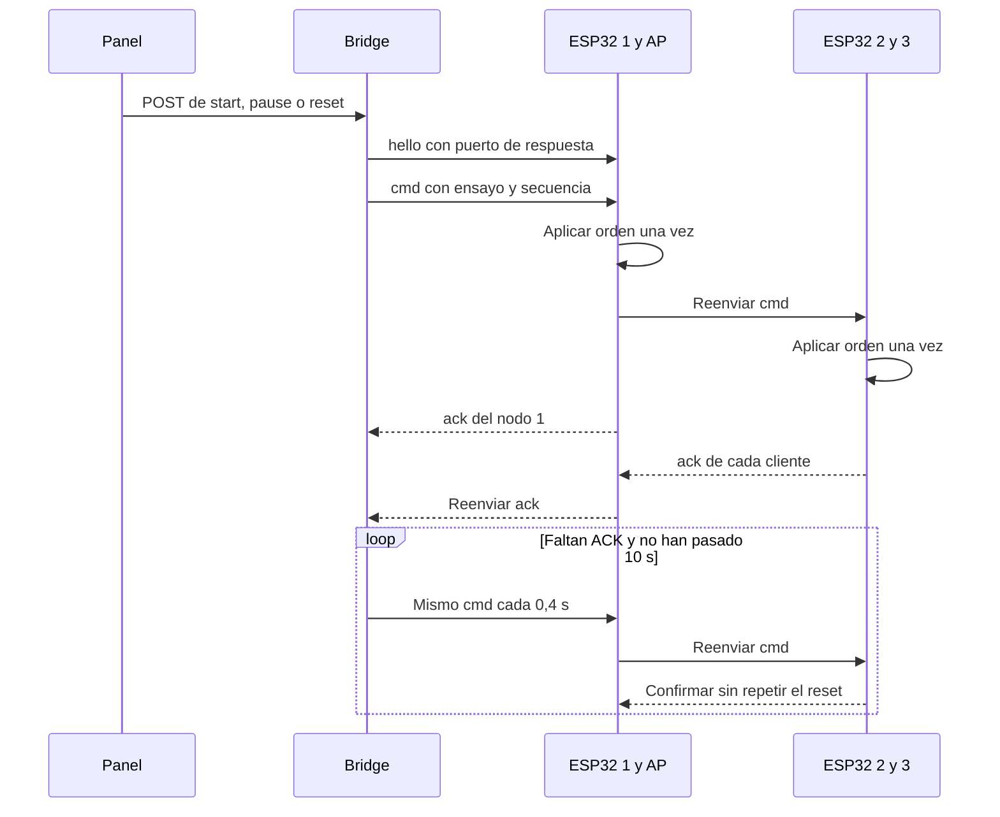

Los reintentos conservan `boot` y `seq`. `Agent.on_packet()` recuerda la última orden aplicada y vuelve a confirmar un duplicado sin repetir su efecto. Descarta comandos antiguos del mismo arranque. Los aportes `ph` no tienen reintentos: `SeenCache` conserva 96 identidades recientes para no depositar dos veces un duplicado y se exige el mismo ensayo.

`wire.encode()` limita a **1400 bytes**. Si `route` coincide con `best_path`, envía una sola lista y `route_same=true`; `decode()` reconstruye el significado. El receptor rechaza mapas distintos y planes con costo incompatible.

Docker Desktop puede cambiar IP y puerto de origen de los mensajes recibidos. `UDP_PROXY_IPS: "auto"` detecta la puerta de enlace del contenedor y permite esa IP. La recepción directa mantiene la comprobación `192.168.4.1:4210`; después se valida el contenido. `REPLY_PORT=4211` anuncia el puerto publicado de Windows para que el AP responda a él, aunque NAT altere el puerto de salida.

## 6. Estados del sistema

### Fases del agente

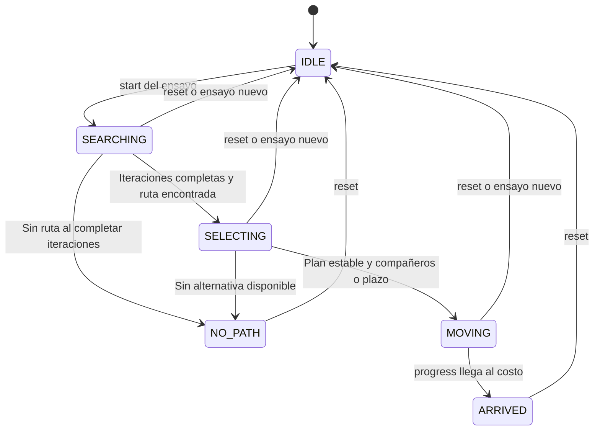

| Fase | Trabajo | Condición de avance |
| --- | --- | --- |
| `IDLE` | Espera en A | `start` activa y pasa a búsqueda |
| `SEARCHING` | Iteraciones y aportes | 160 iteraciones y ruta encontrada |
| `SELECTING` | Espera planes y anuncia elección | Hasta 2500 ms por IDs inferiores; mínimo 600 ms de estabilidad y todos los planes, o plazo de 4000 ms |
| `MOVING` | Incrementa progreso en ruta fija | `progress >= len(route)-1` |
| `ARRIVED` | Detiene avance y reporta | Nuevo ensayo con `reset` |
| `NO_PATH` | Detiene avance sin solución | Nuevo ensayo con `reset` |

Estos umbrales son tiempos acumulados internos, no latencia WiFi medida. Cambiar una propuesta reinicia el tiempo de estabilidad. Un aporte tardío puede mejorar la colonia, pero no cambia la ruta del recorrido una vez en `MOVING`.

### Pausa y fallas

No existe una fase `PAUSED`. Pausar conserva fase, ruta, progreso, feromona e iteración con `running=false`. Reanudar envía `start` del mismo ensayo. La búsqueda y el progreso se congelan, pero recepción y telemetría continúan. Si ya hay ruta, pueden seguir publicándose planes aun estando pausado.

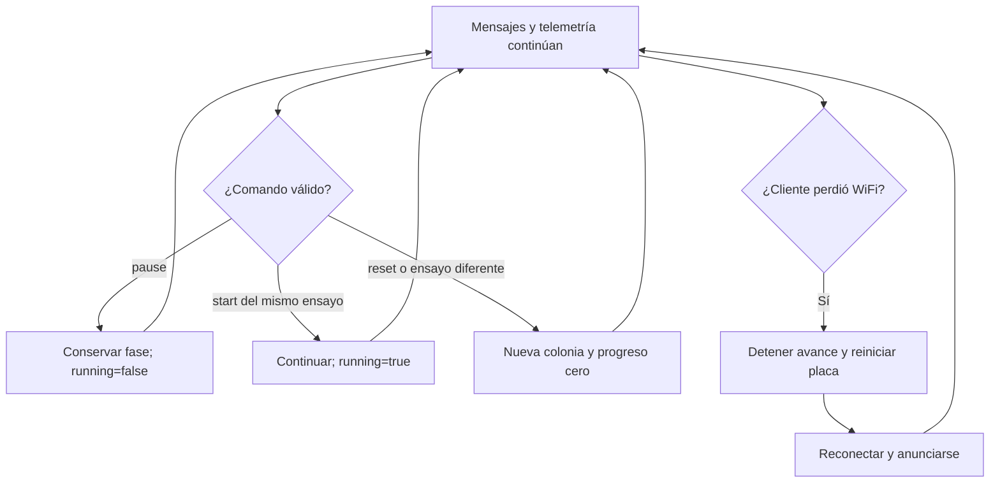

Un cliente desconectado detiene el avance, espera un segundo y ejecuta `machine.reset()`. No restaura una ruta desde disco. El AP puede reenviar el último comando cuando se registra otra vez, pero eso no recupera el instante anterior. Si desaparece el AP se interrumpe el intercambio.

En el panel, `online` requiere telemetría con antigüedad menor de tres segundos. “Desconectado” significa que no llegaron estados recientes; no demuestra que la placa esté apagada. La imagen 2 ilustra este diagnóstico.

## 7. Estructura de la tarea

| Ruta | Papel |
| --- | --- |
| [`firmware/world.py`](firmware/world.py) | Mapa, vecinos, validación y poses |
| [`firmware/aco.py`](firmware/aco.py) | Candidatas, feromona y alternativas |
| [`firmware/agent.py`](firmware/agent.py) | Estados, selección, órdenes y reportes |
| [`firmware/wire.py`](firmware/wire.py) | Protocolo y duplicados |
| [`firmware/transport.py`](firmware/transport.py) | UDP y reenvío |
| [`firmware/main.py`](firmware/main.py) | WiFi y ejecución MicroPython |
| [`nodo1`](firmware/nodo1/config.py), [`nodo2`](firmware/nodo2/config.py), [`nodo3`](firmware/nodo3/config.py) | Configuración individual |
| [`simulador/bridge.py`](simulador/bridge.py) | Puente, validación, CSV y control |
| [`simulador/scene.py`](simulador/scene.py) | Escena y cámara |
| [`simulador/app.py`](simulador/app.py) | HTTP y coordinación de hilos |
| [`simulador/web/index.html`](simulador/web/index.html) | Panel, gráficas y mapa |
| [`Dockerfile`](Dockerfile), [`compose.yaml`](compose.yaml), [`requirements.txt`](requirements.txt) | Entorno virtual en contenedor |
| [`tools/nodos_prueba.py`](tools/nodos_prueba.py) | Agentes CPython opcionales sin placas |
| [`tests/`](tests/) | 18 casos originales |
| [`evidencias/`](evidencias/) | Seis imágenes originales |
| [`data/`](data/) | CSV anterior y CSV V3 |
| [`docs/`](docs/) | Explicación complementaria y prueba local |

`LEEME_CORRECCION_UDP.txt` y `LEEME_ACTUALIZACION_V3.txt` conservan la evolución del programa. La guía actual es este README. Se mantuvieron el código, las imágenes y los CSV originales; la ampliación corresponde a documentación.

## 8. Código de las ESP32 explicado paso a paso

Los seis archivos comunes se ejecutan en las tres placas. Solamente `config.py` cambia el ID. Las funciones se explican siguiendo el orden en que intervienen: representar el mundo, buscar, controlar el agente, preparar mensajes, transportarlos y mantener el bucle principal.

### 8.1. `world.py`: representar y verificar el camino

**Paso 1: construir el mapa.** Al importar el módulo se recorren los IDs y se forma `FREE_CELLS`. Se localizan A y G y se construye `ADJACENCY`, un diccionario que asigna a cada celda la lista de vecinos permitidos. Esta preparación permite que el algoritmo consulte conexiones sin analizar las cadenas del mapa en cada decisión.

**Paso 2: convertir coordenadas.** `cell_id(x,y)` recibe columna y fila y devuelve un entero. `coordinates(node)` recibe ese entero y devuelve `(x,y)`. No producen una distancia ni consultan WiFi; solo cambian la representación.

**Paso 3: revisar si una celda existe.** `free(node)` comprueba tipo entero, rango y carácter distinto de `#`. Devuelve `True` o `False`. `neighbors(node)` prueba derecha, abajo, izquierda y arriba, valida límites y añade solo celdas libres. Devuelve una lista de IDs y nunca incluye una diagonal.

**Paso 4: identificar aristas.** `edge_key(a,b)` devuelve la pareja ordenada de menor a mayor. Así ir de 22 a 43 y volver de 43 a 22 consulta la misma feromona. `EDGES` contiene una sola copia de cada conexión no dirigida.

**Paso 5: validar una ruta completa.** `valid_path(path)` recibe una lista o tupla. Revisa tamaño, salida, meta, celdas libres, ausencia de repetidos y vecindad de cada pareja consecutiva. Devuelve un booleano; una lista que salte sobre un muro se rechaza aunque termine en G. Esta función protege tanto los aportes como los planes recibidos.

**Paso 6: calcular pose.** `pose_on_path(path,progress)` recibe una ruta y un avance expresado en aristas. Acota el progreso, identifica el segmento y su fracción e interpola dentro de él. Devuelve `(x,y,heading)` en celdas y radianes. Sin ruta devuelve A. Con progreso `0.5` sobre `[22,43,...]` devuelve `(1,1.5)` y orientación hacia la siguiente fila. Esa interpolación evita cortar una esquina mediante una diagonal entre estados alejados.

### 8.2. `aco.py`: construir y comparar soluciones

**Paso 1: generar azar reproducible.** `Random32(seed)` conserva un estado entero de 32 bits. `random()` aplica desplazamientos y XOR y devuelve un número en `[0,1)`. Esta implementación no necesita NumPy ni módulos de CPython; el mismo código puede probarse en el PC y cargarse en MicroPython.

**Paso 2: crear la colonia.** `Colony.__init__()` recibe semilla y parámetros ACO. Inicializa todas las feromonas a 1, un archivo vacío, `best_path=None`, límites y contadores. Cada `Agent` crea su propia instancia: el AP no guarda una única colonia para resolverles las rutas a todos.

**Paso 3: escoger vecino.** `_choose(current,choices)` recibe la celda actual y vecinos sin explorar. Primero decide si usa exploración uniforme. Si no, calcula `eta`, consulta `tau[edge_key(current,other)]`, calcula los pesos y acumula hasta superar el valor aleatorio de la ruleta. Devuelve un ID. Esta función no comprueba por sí sola muros porque recibe `choices` construido desde la adyacencia válida.

**Paso 4: construir una candidata.** `construct()` empieza con `[START]` y un conjunto de exploradas. Si llega a G devuelve la lista. Si quedan vecinos, llama a `_choose()` y añade la celda. Si no quedan, hace `path.pop()` y vuelve al nivel anterior. Devuelve `None` si agota la búsqueda. No deposita feromona: construir y reforzar son responsabilidades separadas.

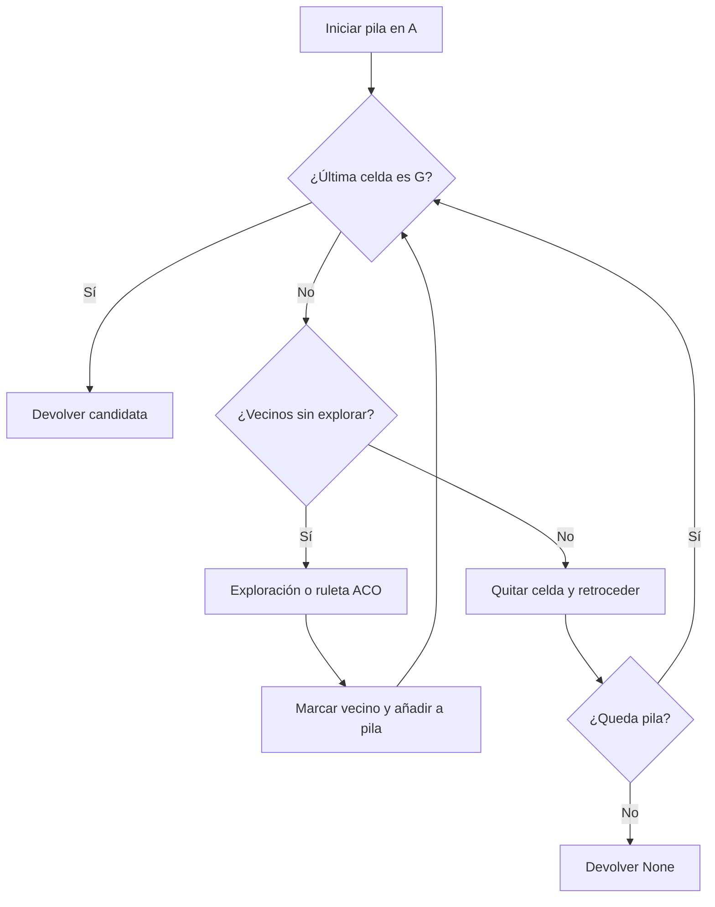

**Paso 5: reforzar y recordar.** `_deposit(path,amount)` suma sobre cada arista y limita a `tau_max`. Modifica la tabla y no devuelve una ruta. `_remember(path)` actualiza la mejor si es más corta, añade rutas diferentes, ordena por longitud y por IDs y recorta el archivo a 12. Una ruta recibida también puede entrar en ese archivo.

**Paso 6: separar mejor costo local y compartido.** `local_best_cost` solo cambia al construir candidatas propias. `best_path` puede mejorar mediante mensajes de otros nodos. Esta diferencia permite distinguir lo descubierto por la placa de lo conocido por cooperación. En el CSV V3 ambos costos finales valen 40 en los tres nodos.

**Paso 7: completar una iteración.** `iterate()` evapora, ejecuta ocho construcciones y para cada candidata válida incrementa `candidates`, calcula costo, deposita `q/cost`, recuerda la solución y actualiza el mínimo local. Después rota un refuerzo extra entre alternativas mínimas e incrementa `iteration`. Devuelve la mejor candidata construida en esa iteración, aunque `Agent` comparte utilizando `share_path()`.

**Paso 8: elegir qué compartir.** `share_path()` recorre el archivo con un cursor y devuelve una ruta o `None`. No envía la matriz entera. Su aporte `q/(len(path)-1)` permite que el receptor refuerce las conexiones correspondientes. Puede compartir distintas rutas del archivo, no solamente una lista idéntica en todos los envíos.

**Paso 9: recibir contribuciones.** `receive_pheromone(path,amount)` exige ruta válida y cantidad numérica positiva no mayor de `q`. Devuelve `False` si se rechaza; si se acepta, deposita, recuerda y devuelve `True`. La condición numérica también rechaza NaN e infinitos al no cumplir el intervalo. La identidad del emisor y los duplicados se comprueban antes, en `Agent`.

**Paso 10: escoger recorrido.** `alternatives()` devuelve las rutas del mejor costo del archivo. `select_route(previous_routes)` forma el conjunto de aristas ya usadas y elige con estos criterios, en orden: no repetir la ruta exacta, compartir menos aristas y desempatar por tupla de IDs. Devuelve una copia de la ruta o `None`. Considera solo alternativas del mejor costo; no sacrifica ese costo para elegir una ruta más larga únicamente por ser distinta.

### 8.3. `agent.py`: transformar búsqueda en un ensayo controlable

**Paso 1: crear identidad y estado.** `Agent(node_id,boot,seed,...)` conserva identidad, tiempos y secuencia. `reset(epoch)` mezcla semilla, ID y caracteres del ensayo, crea una colonia nueva y limpia progreso, contadores compartidos, planes y caché. No borra `seq` ni el identificador `boot` del objeto. `running=false` y `phase=IDLE` dejan al nodo listo para empezar.

**Paso 2: numerar mensajes.** `packet(kind,**fields)` incrementa `seq` y llama a `envelope()`. Devuelve un diccionario con encabezado común. `state()` y `plan()` usan esta misma función; cada mensaje queda asociado a la sesión y al ensayo actuales.

**Paso 3: interpretar una orden.** `on_packet(packet)` recibe un paquete ya decodificado y devuelve una lista de respuestas. Para `cmd` exige `src=0`, acción válida y `epoch` de hasta 40 caracteres. Rechaza secuencias antiguas de la misma sesión. Si es una orden nueva y cambia el ensayo, o es `reset`, reconstruye el estado. Después activa `running` solo para `start`; al comenzar desde `IDLE` pasa a `SEARCHING`. Añade un ACK incluso ante el mismo reintento aceptable.

**Paso 4: recibir feromona.** En `ph` exige otro nodo real y el mismo ensayo. Primero verifica `SeenCache.new()` y después `receive_pheromone()`. Solo aumenta `shared_rx` cuando ambos aceptan. Ese contador representa aportes aplicados, no todos los datagramas WiFi que alcanzaron la placa.

**Paso 5: recibir planes.** En `plan` verifica ruta y costo, que pertenezca al ensayo y que no sea un plan antiguo del mismo arranque. Guarda su identidad en `peer_plans` y la lista en `peer_routes`; también incorpora la solución a la colonia. La elección puede aprovechar una ruta recibida aunque la placa no la construyera antes.

**Paso 6: esperar y seleccionar.** `select(dt_ms)` acumula `selection_ms`. El nodo 1 no espera IDs inferiores; el 2 considera al 1 y el 3 a 1 y 2. Si falta alguno, espera hasta 2500 ms. Luego pide propuesta a `select_route()`. Si no hay, queda en `NO_PATH`. Si es la primera, más corta o evita una repetición conocida, actualiza `route`, reinicia estabilidad y publica `plan`. Después de al menos 600 ms estable empieza a moverse si conoce planes de todos o si el tiempo de selección llega a 4000 ms.

**Paso 7: avanzar por tiempo.** `advance(dt_ms)` acota cada incremento a `[0,250]` ms para no producir saltos enormes tras una demora. Con ruta, publica planes aproximadamente cada 500 ms de tiempo acumulado. Si no está activo o terminó, no busca ni avanza. En búsqueda acumula tiempo y ejecuta como máximo una iteración por llamada; cada cuatro iteraciones comparte. Al llegar a 160 pasa a selección o a `NO_PATH`.

**Paso 8: reproducir el recorrido.** En `MOVING` se aplica:

```python
self.progress = min(len(self.route) - 1.0,
                    self.progress + dt_ms / self.edge_ms)
```

Con 100 ms y `edge_ms=650`, añade aproximadamente 0,1538 aristas. Al completar el costo pasa a `ARRIVED` y desactiva `running`. Este avance es lógico. El límite de 250 ms y el tiempo de cómputo explican por qué una predicción sencilla no equivale al tiempo real completo del ensayo.

**Paso 9: producir telemetría.** `state()` calcula pose sobre la ruta seleccionada o devuelve A si todavía no existe. Devuelve fase, `running`, iteración, mejor costo, costo local, mejor ruta, ruta de recorrido, progreso, pose, envíos, recepciones, alternativas, archivo, candidatas y `elapsed_ms`. Las posiciones se redondean a cuatro decimales. `elapsed_ms` acumula llamadas activas a `advance()`; no es un cronómetro externo ni una medida del desplazamiento físico.

### 8.4. `wire.py`: preparar y revisar cada datagrama

`envelope(src,boot,seq,kind,epoch,**fields)` crea el encabezado y añade el contenido. `encode(packet)` comprime la duplicación de rutas cuando corresponde, convierte a JSON UTF-8 y comprueba longitud. Devuelve bytes listos para el socket; si supera 1400 lanza `ValueError`.

`decode(data)` recibe bytes. Comprueba tamaño y JSON diccionario, versión, mapa, fuente, tipo, sesión y secuencia. Si existe `route_same` exige que sea un estado con referencia válida y reconstruye `route`. Para `plan` revisa fuente, ruta y costo. Devuelve un diccionario; no calcula ACO ni hace la validación completa de toda telemetría, que corresponde al agente o al almacén del PC.

`SeenCache.new(packet)` forma `(src,boot,seq)`. Devuelve `False` para identidad ya guardada y `True` para nueva. Si supera 96 entradas elimina la más antigua. Es una protección de duplicados recientes, no un historial ilimitado ni un sistema criptográfico de autenticación.

### 8.5. `transport.py`: aprender destinatarios y reenviar

**Paso 1: abrir socket.** `Transport.__init__()` crea UDP no bloqueante y escucha el puerto configurado. Guarda direcciones de compañeros, último comando, estados y planes. No calcula rutas.

**Paso 2: registro.** `hello(now_ms)` envía registro al AP en los clientes. El nodo 1 no se registra ante sí mismo. El PC tiene su propio `hello()` en `Bridge` y anuncia dónde recibir respuestas.

**Paso 3: enviar.** `_send(packet,address)` codifica y usa `sendto`; errores de envío o tamaño aumentan `errors`. `publish(packet,now_ms)` en un cliente envía al AP; en el nodo 1 conserva sus estados o planes y los reparte mediante `_fanout()`.

**Paso 4: repartir.** `_fanout(packet,now_ms,exclude)` elimina destinatarios sin actividad por más de 7000 ms. El PC recibe los mensajes reenviados; las placas reciben solo `ph`, `cmd` y `plan`. No se inunda a los clientes con todos los estados de sus compañeros. `exclude` evita devolver el mensaje al emisor inmediato.

**Paso 5: recibir.** `receive(now_ms)` intenta procesar hasta 24 datagramas por llamada. Decodifica y descarta inválidos. En AP, un `hello` registra dirección; al PC recién registrado le envía estados conservados. A un cliente que reaparece puede enviar último comando y planes. Otros paquetes deben llegar desde una IP previamente registrada. El AP conserva comandos actuales, estados de clientes y planes recientes y reenvía lo permitido.

En clientes solo admite paquetes desde IP y puerto del AP. Devuelve la lista de mensajes que el agente debe interpretar. Esta separación permite probar el transporte con UDP de loopback sin emular hardware WiFi.

### 8.6. `main.py` y `config.py`: ejecutar en MicroPython

`setup_wifi()` decide AP o cliente según `NODE_ID`. En el nodo 1 configura SSID, contraseña, máximo de cuatro clientes e IP estática. En clientes intenta conectar y espera hasta 20 segundos; si no consigue AP lanza un error. Usa nombres de API compatibles con dos variantes de MicroPython.

`run()` comprueba que el ID sea 1, 2 o 3, genera semilla con identidad de hardware y tiempo, crea `Agent` y `Transport` y configura el LED únicamente si se habilita. En el bucle:

1. Calcula `dt` con `ticks_diff` y acumula un `uptime` para el transporte.
2. Revisa si un cliente perdió WiFi; en tal caso detiene y reinicia la placa.
3. Envía `hello` de cliente cada 1000 ms.
4. Recibe paquetes, llama a `agent.on_packet()` y publica respuestas.
5. Llama a `agent.advance(dt)` y publica los aportes o planes generados.
6. Emite `state` aproximadamente cada 200 ms y añade `net_errors`.
7. Actualiza LED opcional y escribe en consola cambios de fase.
8. Ejecuta recolección de memoria cada 2000 ms y espera 10 ms antes del siguiente ciclo.

El bloque `finally` cierra el socket y apaga el LED opcional. Guardar `main.py` en la raíz hace que MicroPython lo ejecute al reiniciar. `config.py` define ID, WiFi y tiempos; no contiene otra implementación de ACO. Un mismo `NODE_ID` en dos placas produciría identificación incorrecta en el concentrador y en el panel.

## 9. Código del computador explicado paso a paso

### 9.1. `bridge.py`: referencia, datos y control

**Referencia independiente.** `minimum_steps()` recorre el grafo con BFS y devuelve el costo mínimo o `None`. Como todas las aristas cuestan un paso, BFS permite calcular ese mínimo. `maze_metrics()` obtiene distancias, número de caminos mínimos, celdas, aristas, cruces, callejones y ciclos. Sus resultados sirven para evaluar las rutas; **no se transmiten a las placas como rutas resueltas**.

**Recepción con Docker.** `trusted_udp_proxies()` recibe configuración explícita o `auto`. En este último lee rutas IPv4 de Linux, selecciona una puerta de enlace predeterminada por métrica y devuelve sus IP permitidas. Si no hay ruta adecuada lanza un error que permite diagnosticar la configuración. No cambia la dirección del AP al que se envía control.

**Preparar almacenamiento.** `TelemetryStore(data_dir)` crea un candado reentrante, estados por nodo, historiales y archivo de alternativas recibido. Abre `telemetria_multirruta_v3.csv` en modo añadir y escribe encabezado solo si es nuevo o vacío. Las rutas completas viven en memoria; el CSV registra métricas y poses, no la lista completa de cada ruta.

**Delimitar un ensayo.** `set_epoch(epoch)` fija el ensayo esperado y limpia nodos, historiales y alternativas de la vista. No trunca el CSV, ni reinicia los contadores globales de paquetes y errores. `remember_alternative(node,path)` valida y conserva hasta 12 rutas diferentes ordenadas por costo.

**Aceptar una telemetría.** `accept(packet,now)` es el punto principal de validación. Aumenta el contador de paquetes que procesa y verifica nodo y ensayo. En `ph` o `plan` puede conservar una ruta sin generar una fila de estado. En `state` sigue este orden:

1. Rechaza secuencias repetidas o anteriores del mismo `boot`.
2. Verifica mejor ruta y que `best_cost = len(best_path)-1`.
3. Verifica ruta de recorrido y fase permitida.
4. Exige ruta para fases `MOVING` o `ARRIVED`.
5. Exige progreso finito entre cero y el costo del recorrido.
6. Calcula la pose esperada con `pose_on_path()` y rechaza diferencias mayores de 0,02 celdas o coordenadas no finitas.
7. Guarda el estado y tiempo de recepción, recuerda rutas y actualiza historial si cambió iteración o costo.
8. Escribe una fila CSV y hace `flush()`.

Devuelve `True` cuando registró un estado. Puede devolver `False` sin tratarse de un error, por ejemplo al recibir un aporte o una secuencia ya procesada. Por ello “paquetes”, “filas de CSV” y “errores” son contadores diferentes.

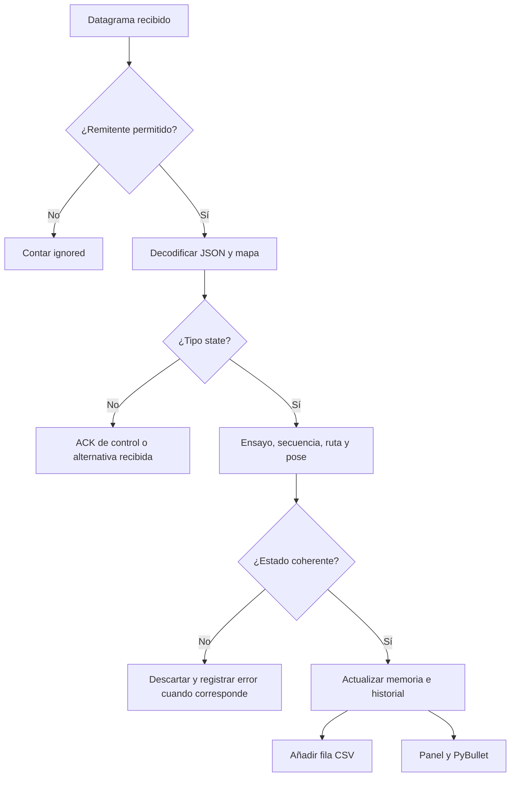

**Crear vista del panel.** `snapshot()` devuelve copias de estados y añade antigüedad, `online`, `optimal`, costo del recorrido, historial y rutas recibidas. `distinct_routes` cuenta listas exactas de recorrido diferentes; no cuenta colores ni archivos de alternativas. Si un estado contiene `test_source`, identifica el conjunto como `PRUEBA_LOCAL`. La etiqueta normal `ESP32` significa que el mensaje no llevaba esa marca de prueba; por sí sola no autentica hardware.

**Exportar.** `export()` asegura escritura y devuelve los bytes del CSV acumulado. `close()` cierra el archivo. No se utiliza SQLite en esta tarea: la persistencia corresponde a CSV y los estados de consulta rápida se conservan en RAM.

**Enviar control.** `Bridge` abre el socket UDP, crea identidad del PC, guarda secuencia y un comando pendiente. `sender_is_allowed(address)` exige AP correcto o proxy configurado. `network_status()` devuelve recepción, descartes de remitente, última dirección y puertos para diagnóstico.

`issue(action)` valida `start`, `pause` o `reset`. Si no hay ensayo o se pide reset crea uno nuevo y llama a `set_epoch()`. Construye `cmd`, guarda el conjunto de ACK y el instante, anuncia puerto con `hello()` y envía el comando. Devuelve acción, ensayo y secuencia al HTTP. Una respuesta HTTP correcta significa que el servidor aceptó emitir la orden; la confirmación de las tres placas se consulta después.

`run()` mantiene `hello` cada segundo y reintenta el comando pendiente cada 0,4 s durante un máximo de 10 s. Cuenta datagramas antes de comprobar remitente, decodifica, añade ACK cuando coinciden `cmd_boot` y `cmd_seq`, y pasa mensajes a `TelemetryStore.accept()`. `status()` devuelve confirmados, pendientes y plazo vencido. `start()` inicia el hilo; `close()` lo detiene y cierra socket.

### 9.2. `scene.py`: convertir estado en una imagen 3D

`Scene(width,height)` conecta PyBullet en `DIRECT`: no abre una ventana OpenGL. Configura gravedad, paso de simulación y cámara, y construye el mapa. `_box()` crea una caja visual con colisión opcional y masa cero. `_build()` crea suelo, muros, celdas A/G y tres vehículos de colores.

`_car(color)` crea cuerpo, ruedas visuales, cabina y marcador. Las ruedas son enlaces fijos y las masas son cero; no se actúan motores. `_route(node,path)` crea segmentos de color sobre el suelo y reemplaza los anteriores solamente cuando cambia la ruta.

`update(snapshot,dt)` toma cada estado, actualiza la polilínea y mantiene una identidad de visualización formada por arranque, ensayo y ruta. Suaviza el progreso mostrado hacia el recibido, interpola la pose y usa `resetBasePositionAndOrientation()` para ubicar el cuerpo. Convierte celdas a metros y cambia el signo de Y para adaptar el mapa. Los pequeños desplazamientos laterales separan visualmente los tres nodos.

Llamar a `stepSimulation()` no convierte este seguimiento en dinámica de motores: la pose sigue impuesta por telemetría. `wall_collisions()` sirve para detectar intersecciones geométricas con muros en pruebas; no es un controlador en tiempo real para evitar otros vehículos.

`configure_camera(action,dx,dy)` recibe reset, órbita, desplazamiento o zoom. Acota inclinación y distancia y protege cambios con un candado. `render()` calcula matrices de vista y proyección, usa `ER_TINY_RENDERER`, convierte imagen con NumPy/Pillow y devuelve JPEG. `close()` desconecta solo si el cliente sigue conectado.

### 9.3. `app.py`: unir recepción, render y servidor HTTP

`Runtime(options)` crea almacén, puente y escena. `start()` inicia hilo UDP y hilo de visualización. `physics()` consulta estados aproximadamente cada 25 ms y genera imagen si transcurrieron al menos 0,12 s. Guarda el último JPEG bajo un candado. Si el render falla registra el error y marca parada. Estos intervalos son objetivos de programación, no tasas físicas medidas.

`snapshot()` reúne telemetría, control, diagnóstico UDP y estado del renderizador. `close()` señala parada, espera el hilo y cierra puente, PyBullet y CSV. `main()` interpreta argumentos y variables de entorno, abre `ThreadingHTTPServer`, muestra URL y puertos, y permite terminar con `Ctrl+C` o señal de Docker.

`handler_for(runtime)` crea el manejador HTTP. `respond()` prepara tipo, longitud y contenido sin caché; `json()` serializa datos. Las rutas son:

| Ruta HTTP | Entrada o respuesta | Función |
| --- | --- | --- |
| `GET /` | HTML | Carga panel |
| `GET /frame.jpg` | Último JPEG | Vista 3D |
| `GET /api/state`, `/api/results` | JSON de `snapshot()` | Estado de nodos y control |
| `GET /api/export` | CSV | Descarga registros acumulados |
| `GET /health` | JSON y 200 o 503 | Salud del renderizador; no certifica conectividad de placas |
| `POST /api/command` | JSON con `action` | Emite orden a los nodos |
| `POST /api/camera` | Acción y desplazamientos | Cambia cámara |

`do_POST()` limita el cuerpo a 2048 bytes y devuelve 400 para una acción o contenido inválido. Las rutas desconocidas devuelven 404. Los controles de cámara modifican solo la vista, no rutas ni feromonas.

### 9.4. `index.html`: presentar información sin resolver las rutas

La página contiene HTML y CSS de la interfaz y JavaScript de consulta. `post(path,body)` envía JSON y verifica respuesta. Los botones de control usan `/api/command`; el servidor y las placas realizan el cambio. **Reanudar usa la misma acción `start`**, con el ensayo actual.

`refresh()` consulta `/api/state` cada 350 ms. `renderState(s)` cuenta nodos online, muestra fase, costo, iteración, alternativas, candidatas y aportes y explica ACK pendientes. La barra indica proporción de iteraciones, no porcentaje del trayecto. La etiqueta “mínimo encontrado” compara el mejor costo conocido con BFS.

`drawChart(s)` dibuja mejor costo frente a iteración. La referencia mínima aparece discontinua; aplica pequeños desplazamientos visuales para distinguir líneas coincidentes. `drawMap(s)` pinta la cuadrícula, ruta seleccionada o mejor conocida, posiciones y, si se activa la casilla, alternativas recibidas discontinuas. No inventa rutas nuevas.

Los eventos del mouse acumulan desplazamiento y solicitan órbita o pan; la rueda solicita zoom. El panel pide nuevos JPEG después de cargar el anterior. La tasa visible depende de render, red local y navegador; el intervalo no demuestra una tasa constante de fotogramas.

### 9.5. Docker, herramientas y pruebas

`Dockerfile` usa Python 3.11, instala PyBullet 3.2.7, NumPy 1.26.4 y Pillow 11.3.0 y arranca `python -m simulador.app`. `compose.yaml` publica puertos, monta `data` con escritura y código con lectura. La imagen conserva dependencias; los montajes aseguran que se utilice el mapa del proyecto local.

`tools/nodos_prueba.py` crea tres `Agent` y tres `Transport` en CPython con UDP local. Usa la misma búsqueda, pero añade `test_source` para mostrar **PRUEBA LOCAL · sin placas**. No se inicia desde el arranque normal ni desde Compose. Sirve para revisar instalación sin atribuir resultados al hardware.

Los tres archivos `tests/test_project.py`, `test_docker_udp.py` y `test_multirruta.py` cubren algoritmo, estados, transporte, proxy, validación y visualización. Sus alcances y lo ejecutado durante esta revisión están reunidos en la sección 16.

## 10. Un ensayo completo, desde Iniciar hasta el CSV

Este ejemplo recorre el programa; los números finales del montaje se consultan en la sección 13.

1. **Encendido.** La ESP32 1 configura el AP y las otras se conectan. Cada una importa el mapa y crea una colonia con feromonas iniciales. Los clientes envían `hello` y reportan `IDLE`.
2. **Arranque virtual.** Docker inicia almacén, UDP, PyBullet y HTTP. El puente del PC anuncia su puerto de respuesta. El AP le envía los estados conservados y el panel identifica los tres nodos recientes.
3. **Orden de inicio.** El usuario pulsa Iniciar. El navegador hace `POST /api/command` con `{"action":"start"}`. `Bridge.issue()` crea el primer ensayo si todavía no existe y transmite `cmd`.
4. **Confirmación.** Cada agente aplica el inicio, cambia a `SEARCHING` y devuelve ACK. El PC vuelve a enviar la misma orden si falta alguno. El panel diferencia una orden emitida de una confirmada por las tres placas.
5. **Construcción.** Cada agente acumula tiempo y llama a `iterate()`. Ocho hormigas exploran vecinos y retroceden en callejones. Las rutas válidas refuerzan la tabla local y entran en el archivo de soluciones.
6. **Cooperación.** Cada cuatro iteraciones comparte una ruta con `amount=4/L`. El AP la reenvía. El receptor valida ensayo, duplicado y ruta, deposita y aumenta su contador.
7. **Comparación durante búsqueda.** El PC valida los estados y calcula si el mejor costo coincide con 40. Todavía no asigna trayectos desde BFS. Los robots permanecen en la salida hasta tener ruta seleccionada.
8. **Elección.** Tras 160 iteraciones pasa a `SELECTING`. Los nodos consideran planes de IDs inferiores, anuncian su ruta y esperan estabilidad y compañeros o plazo. Pueden quedar menos de tres rutas diferentes.
9. **Recorrido lógico.** En `MOVING`, el temporizador incrementa `progress`. Con una ruta de 40 aristas, `progress=20.5` coloca al agente entre las celdas de índices 20 y 21, no en una diagonal directa entre dos reportes.
10. **Representación.** El PC confirma que `x,y` corresponden al progreso. PyBullet suaviza sobre la misma polilínea, coloca el robot y genera JPEG. El panel muestra posición, mejor costo y contadores.
11. **Llegada.** Al alcanzar 40, el agente pasa a `ARRIVED` y deja de avanzar, pero sigue enviando estados. Esto produce varias filas de llegada iguales salvo secuencia y recepción.
12. **Registro.** Exportar CSV descarga el archivo acumulado. `epoch` permite separar ensayos y `source` distingue el verificador local marcado. Para otro ensayo se pulsa Reiniciar y después Iniciar.

## 11. Programación y ejecución desde la terminal

### 11.1. Preparar cada ESP32 con Thonny

Se necesita MicroPython compatible con el modelo de placa. La base de desarrollo usó referencias de API de MicroPython 1.26.0; `setup_wifi()` incluye compatibilidad de nombres de WLAN. La programación de placas se realiza con Thonny, mientras Docker se ejecuta en PowerShell.

1. Conecta una placa con cable USB de datos y selecciona en Thonny **MicroPython (ESP32)** y su puerto COM real.
2. Si necesita firmware, usa la función de instalar o actualizar MicroPython para el modelo concreto.
3. Activa la vista Archivos y copia a la **raíz del ESP32** `world.py`, `aco.py`, `wire.py`, `agent.py`, `transport.py` y `main.py` desde `firmware/`.
4. Copia únicamente el `config.py` que corresponda a esa placa, renombrado como `config.py` en su raíz.
5. Guarda `main.py` al final y reinicia. Repite con las otras placas.

| Placa | Configuración del computador | Nombre en la ESP32 |
| --- | --- | --- |
| Nodo 1, AP | `firmware/nodo1/config.py` | `config.py`, `NODE_ID=1` |
| Nodo 2, cliente | `firmware/nodo2/config.py` | `config.py`, `NODE_ID=2` |
| Nodo 3, cliente | `firmware/nodo3/config.py` | `config.py`, `NODE_ID=3` |

Deben quedar **siete archivos Python en la raíz de cada placa**. No copies las carpetas `nodo1/nodo2/nodo3` como sustituto del archivo de configuración. Las tres deben tener el mismo `world.py` V3 y el mismo SSID y contraseña.

Enciende primero el nodo 1. Su consola debe mostrar `AP listo`, la dirección `192.168.4.1` y `READY ACO nodo 1`. Los otros mostrarán `WiFi listo` y `READY ACO nodo 2` o `3`. Si Thonny indica dispositivo ocupado pulsa Detener o `Ctrl+C` para editar; después reinicia para volver a ejecutar `main.py`.

### 11.2. Entrar a la carpeta correcta

Copia la entrega dentro de tu carpeta local del repositorio. Abre PowerShell en la raíz de `corte-2-tareas` y entra a la nueva tarea:

```powershell
cd .\07-enjambre-aco-esp32-pybullet
```

Si abriste PowerShell directamente dentro de esa tarea, no necesitas ese `cd`. En esta carpeta deben aparecer `compose.yaml`, `Dockerfile`, `firmware` y `simulador`.

### 11.3. Construir con acceso a internet

Abre Docker Desktop y espera a que el motor con contenedores Linux esté listo. Comprueba:

```powershell
docker --version
docker compose version
docker compose config
```

Con internet, antes de conectarte al AP de las placas, construye:

```powershell
docker compose build
```

La imagen descarga Python y las dependencias. La ejecución posterior del ensayo no necesita internet. No se incluye un entorno virtual dentro de la entrega.

### 11.4. Iniciar el montaje

Enciende nodo 1, después 2 y 3. Conecta el WiFi del computador a **ENJAMBRE_ACO** con **Hormigas2026**. Mantén esa conexión aunque Windows diga que no tiene internet.

Ejecuta en PowerShell:

```powershell
docker compose up -d
```

Comprueba el servicio y sus mensajes:

```powershell
docker compose ps
docker compose logs --tail 60 gemelo
```

Debe aparecer el servicio en ejecución y mensajes como `PyBullet listo. Panel: http://127.0.0.1:18080` y `Esperando ESP32 por UDP 4211`. Abre:

```text
http://127.0.0.1:18080
```

Espera **3/3 nodos conectados** y pulsa Iniciar. La búsqueda, selección y recorrido son fases distintas: los robots no empiezan a moverse mientras las placas siguen buscando.

Después de haber creado el contenedor, también puedes iniciarlo desde el botón de Docker Desktop del proyecto Compose correspondiente. Ese botón inicia el servicio; **Iniciar del panel comienza el ensayo ACO**. Se requieren ambas cosas y la conexión WiFi al AP.

### 11.5. Controles y cierre

| Control | Efecto real |
| --- | --- |
| Iniciar | `start`; activa búsqueda desde reposo |
| Pausar | `pause`; conserva fase y progreso |
| Reanudar | `start` del mismo ensayo |
| Reiniciar | `reset`; nuevo ensayo y colonia |
| Ver alternativas exploradas | Líneas discontinuas de rutas recibidas; no cambia ACO |
| Exportar CSV | Descarga archivo acumulado |
| Arrastrar escena | Órbita de cámara |
| Shift y arrastrar | Desplazamiento de cámara |
| Rueda | Zoom |
| Centrar cámara | Restaurar vista inicial |

Para repetir al terminar, pulsa Reiniciar y después Iniciar. Para cerrar el servicio:

```powershell
docker compose down
```

El directorio local `data/` permanece porque se monta desde el computador. Cerrar Docker no equivale a pausar las placas: los agentes que ya recibieron `start` pueden continuar por su cuenta mientras están alimentados.

Si prefieres logs en la misma consola, usa `docker compose up` sin `-d`; al terminar pulsa `Ctrl+C` y luego `docker compose down`.

### 11.6. Actualizar código sin reconstruir dependencias

El Compose monta `firmware/` y `simulador/` como solo lectura. Después de copiar cambios, recrea el servicio para volver a importar el código:

```powershell
docker compose up -d --force-recreate gemelo
```

Si cambian `requirements.txt` o la base de `Dockerfile`, reconstruye con internet antes de conectar al AP. Si cambias `world.py`, actualiza mapa e identificador **en las tres placas y en el computador**; un montaje con archivos antiguos se rechaza por mapa incompatible.

### 11.7. Alternativa Python directo

La alternativa sirve para diagnóstico. El contenedor entregado utiliza Python 3.11; usar esa versión directamente mantiene correspondencia con su entorno declarado. En una consola con internet:

```powershell
py -3.11 -m venv .venv
.\.venv\Scripts\python.exe -m pip install -r requirements.txt
```

Después de conectarte al AP:

```powershell
.\.venv\Scripts\python.exe -m simulador.app
```

Abre `http://127.0.0.1:8080`. Ejecuta **una sola instancia receptora**: Docker o Python directo, porque ambos intentan escuchar `4211/UDP`.

Para prueba opcional **sin placas**, ejecuta en la primera consola:

```powershell
.\.venv\Scripts\python.exe -m simulador.app --hub 127.0.0.1
```

En una segunda consola dentro de la misma tarea:

```powershell
.\.venv\Scripts\python.exe tools\nodos_prueba.py
```

Abre el panel de puerto 8080 y pulsa Iniciar. Debe indicar **PRUEBA LOCAL · sin placas ESP32**. Esta prueba no debe confundirse con las evidencias del montaje de la sección 14.

## 12. Datos guardados y comportamiento al reiniciar

### Archivos incluidos

| Archivo | Contenido y alcance |
| --- | --- |
| [`data/telemetria_multirruta_v3.csv`](data/telemetria_multirruta_v3.csv) | 7982 filas, marcadas `ESP32`; ensayo V3 y reposo; 21 columnas |
| [`data/telemetria.csv`](data/telemetria.csv) | 2806 filas de una versión anterior: 80 iteraciones y ruta de 14 pasos; no usar como resultado V3 |
| [`docs/telemetria_prueba_local.csv`](docs/telemetria_prueba_local.csv) | Registro separado del ensayo local marcado `PRUEBA_LOCAL` |
| [`docs/resultados_prueba_local.json`](docs/resultados_prueba_local.json) | Estado completo y rutas de ese ensayo sin placas |
| [`docs/mapa.svg`](docs/mapa.svg) | Mapa con rutas de la prueba local; no captura física |
| [`docs/vista_pybullet_prueba_local.png`](docs/vista_pybullet_prueba_local.png) | Ilustración de poses de esa prueba local |

La nueva aplicación escribe en `telemetria_multirruta_v3.csv`, por lo que no mezcla el encabezado de la versión antigua con las columnas nuevas. Se conservaron ambos CSV originales para no perder evidencia; sus resultados no se suman como si fueran un mismo experimento.

### Qué registra cada columna

| Columnas | Interpretación |
| --- | --- |
| `rx_utc` | Fecha de recepción del PC en UTC; no hora interna de ESP32 |
| `epoch`, `node`, `boot`, `seq` | Ensayo, nodo, arranque y secuencia |
| `phase`, `running` | Fase y actividad del agente |
| `iteration`, `candidates` | Iteración actual y candidatas construidas válidas |
| `best_steps`, `local_steps`, `route_steps` | Mejor costo conocido, mejor costo local y costo del recorrido |
| `x_cells`, `y_cells`, `progress` | Pose lógica y avance sobre el camino |
| `shared_tx`, `shared_rx` | Contribuciones enviadas y aceptadas |
| `elapsed_ms` | Tiempo activo acumulado por el agente, incluyendo búsqueda, selección y recorrido |
| `source` | Marca `ESP32` o `PRUEBA_LOCAL` según presencia de `test_source` |
| `alternatives`, `archive_size` | Alternativas mínimas y tamaño del archivo de colonia |

La columna `route_steps` permite conocer costo, pero **no reconstruir el camino exacto**. El CSV no guarda la lista de IDs ni los mensajes `plan/ph` completos. Para conservar rutas exactas de nuevos ensayos, puede guardarse el JSON de `/api/results` antes de reiniciar, mientras el estado sigue en memoria:

```powershell
Invoke-RestMethod http://127.0.0.1:18080/api/results |
    ConvertTo-Json -Depth 30 |
    Set-Content -Encoding UTF8 .\data\estado_ensayo.json
```

El nombre anterior es un ejemplo de archivo nuevo, no una evidencia ya incluida. Para exportar el CSV desde terminal:

```powershell
Invoke-WebRequest http://127.0.0.1:18080/api/export -OutFile .\data\exportacion_ensayo.csv
```

### Qué permanece y qué se pierde

| Acción | Conserva | Limpia o cambia |
| --- | --- | --- |
| Pausar | Fase, feromona, ruta, progreso y archivo | Solo desactiva avance; telemetría sigue |
| Reanudar | Mismo ensayo y estado | Activa avance |
| Reiniciar desde panel | CSV acumulado y código | Nuevo `epoch`, colonia y rutas; vista e historiales se limpian |
| Reiniciar una ESP32 | Archivos MicroPython guardados | RAM, progreso, feromona y sesión de arranque |
| Reiniciar Docker | CSV del volumen local | RAM del PC, historial, último control y referencias de vista |
| Apagar todas las placas | Código en sus sistemas de archivos | Ensayo en RAM; no hay restauración automática |

El AP conserva último comando y estados **en memoria**, no en un archivo permanente. Mientras siga encendido puede responder a un PC que vuelve a registrarse, pero eso no restaura el historial anterior del proceso Docker. El CSV se abre en modo añadir y continúa creciendo; Exportar CSV descarga el conjunto acumulado, no filtra automáticamente un ensayo.

## 13. Resultados y análisis de las gráficas

### Montaje V3 registrado

Condiciones del registro: tres ESP32, mapa V3, ocho hormigas, 160 iteraciones, `ITERATION_MS=100`, `EDGE_MS=650`, aportes cada cuatro iteraciones. El CSV contiene reposo y el ensayo `6db03a9a5d1d`. Los valores finales coinciden con los contadores de la imagen 3.

| Nodo | Estado | Iteraciones | Mejor / local / recorrido | Candidatas | Alternativas mínimas | Enviados | Recibidos | `elapsed_ms` final |
| --- | --- | ---:| --- | ---:| ---:| ---:| ---:| ---:|
| ESP32 1 | `ARRIVED` | 160 | 40 / 40 / 40 pasos | 1280 | 12 | 40 | 75 | 66513 |
| ESP32 2 | `ARRIVED` | 160 | 40 / 40 / 40 pasos | 1280 | 12 | 40 | 78 | 69893 |
| ESP32 3 | `ARRIVED` | 160 | 40 / 40 / 40 pasos | 1280 | 12 | 40 | 77 | 70126 |

Estas son métricas reportadas por firmware y guardadas por el PC. El tiempo equivale a 66,513 s, 69,893 s y 70,126 s de acumulación interna activa. Incluye búsqueda, selección y avance y no es tiempo exclusivamente de recorrido ni una medición independiente con cronómetro. Tampoco representa el tiempo que siguieron encendidas las placas reportando llegada.

### Resultados reunidos por origen

| Resultado | Valor | Origen y condición | Evidencia |
| --- | --- | --- | --- |
| Placas del montaje | 3 visibles | Fotografía física | Imagen 5 |
| Nodos conectados | 3/3 | Telemetría del montaje en captura | Imagen 1 |
| Llegada de nodos | 3 en G `(19,15)` | Estado lógico reportado por ESP32 | Imagen 3 y CSV V3 |
| Calidad final | 40 pasos cada uno | Costos reportados; referencia del grafo calculada | Imágenes 3 y 4, CSV |
| Rutas distintas seleccionadas | **2/3** | Valor visible del panel del montaje | Imagen 4; CSV no contiene listas para recuento independiente |
| Aportes enviados totales | 120 | Suma calculada de tres contadores de 40 | CSV V3 |
| Aportes recibidos totales | 230 | Suma calculada de 75 + 78 + 77 | CSV V3 |
| Datagrama / error en captura | 6933 / 0 | Contadores del panel en ese instante; no cierre completo del archivo | Imagen 4 |
| Registros CSV V3 | 7982 filas | Conteo del archivo completo; incluye reposo y estados repetidos de llegada | CSV V3 |
| Rutas mínimas posibles | 23 de 40 pasos | Cálculo del grafo y prueba de enumeración | `maze_metrics()` y prueba multirruta |
| Longitud de modelo | 20 m | Cálculo `40 * 0.50`; escala ilustrativa | Código del mapa |
| Recorrido nominal | 26 s | Cálculo `40 * 650 ms`; excluye búsqueda, selección y demoras | Configuración |
| Espera de búsqueda nominal mínima | 16 s más cálculo | `160 * 100 ms`; intervalo, no duración física medida | Configuración |
| Diversidad de prueba local | 3 rutas mínimas distintas | Agentes CPython con 4 ms por iteración y 12 ms por arista | JSON y documentación local |
| Verificación en esta revisión | 16 pruebas aprobadas | CPython y sockets locales; sin nuevas mediciones de hardware | Sección 16 |

Cero errores del panel no significa cero pérdidas de WiFi. Cada aporte de una placa podría recibirse en las otras dos: con 120 envíos habría 240 recepciones en una distribución completa. Se registran 230 aportes aceptados. La diferencia de 10 no es una tasa física de pérdida certificada: también intervienen condiciones de registro, ensayo, validación y deduplicación, y no se dispone de captura completa del tráfico para aislar la causa.

### Cómo interpretar las dos gráficas

**Mejor ruta por nodo.** El eje horizontal representa iteración ACO y el vertical pasos del mejor camino conocido. Menor es mejor. La línea de referencia vale 40, calculado por BFS. En la imagen 4 las líneas quedan alrededor de 40 hasta 160: el mejor valor registrado en la gráfica ya es mínimo y después se conserva. Esto no significa que todas las candidatas midieran 40 ni que existiera una mejora gradual visible en ese ensayo. El panel aplica separación gráfica pequeña entre líneas para distinguir colores; esa separación no es una diferencia real de costo.

**Mapa y rutas recibidas.** Muestra dónde pasan las listas de recorrido. Dos rutas pueden tener igual costo y ser diferentes; también pueden compartir muchos segmentos. En la captura el contador dice 2/3 porque dos nodos eligieron la misma lista y el otro una distinta. Tres colores no bastan para demostrar tres caminos. Activar alternativas dibuja rutas guardadas discontinuas y no cambia las elecciones ya realizadas.

### Qué concluyo de estos resultados

Pude comprobar que el montaje reportó búsqueda y llegada en los tres nodos, con costos mínimos y aportes recibidos. La cooperación no garantizó tres elecciones distintas en este ensayo. Los 12 caminos mínimos guardados por cada nodo muestran alternativas disponibles, pero el resultado final depende de los planes conocidos y los tiempos de selección. La prueba local demuestra que el código puede producir tres alternativas bajo sus condiciones; no reemplaza la cifra observada del montaje.

## 14. Evidencias en imágenes

Se presentan todas las imágenes originales con su nombre exacto. No se añadió un video ficticio ni se usaron imágenes generadas para representar el montaje. Los diagramas anteriores explican el programa; las fotografías siguientes documentan lo entregado.

### Imagen 1 · Panel listo y tres nodos

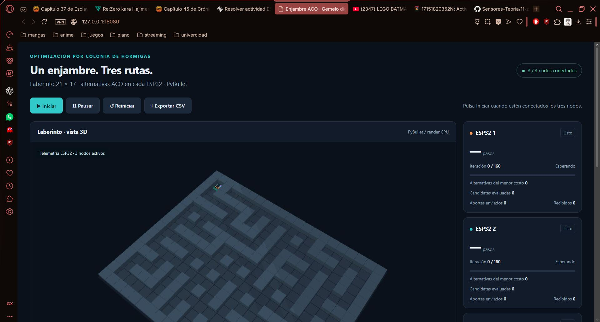

Se ve `127.0.0.1:18080`, el laberinto V3 y **3/3 nodos conectados**. Los contadores de búsqueda visibles están en cero: sirve para mostrar conexión y estado listo, no el resultado final.

### Imagen 2 · Diagnóstico de falta de telemetría

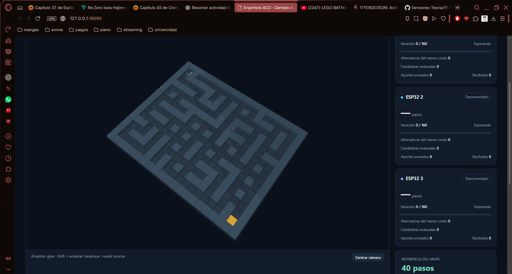

Las tarjetas de nodos 2 y 3 aparecen desconectadas y sin costo. La imagen muestra que el panel distingue ausencia de mensajes recientes. No se utiliza como demostración de un ensayo exitoso ni se afirma una causa concreta de la desconexión a partir de la captura.

### Imagen 3 · Llegada y contadores

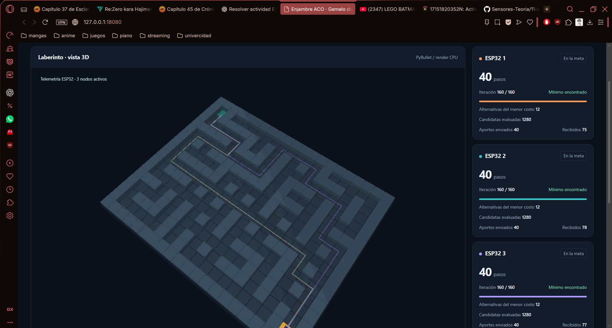

Los tres indican **En la meta**, 40 pasos, 160/160, 12 alternativas y 1280 candidatas. Los aportes visibles son 40 enviados por nodo y 75, 78 y 77 recibidos. Las líneas pertenecen a rutas reportadas y el movimiento sigue siendo lógico.

### Imagen 4 · Calidad y diversidad real

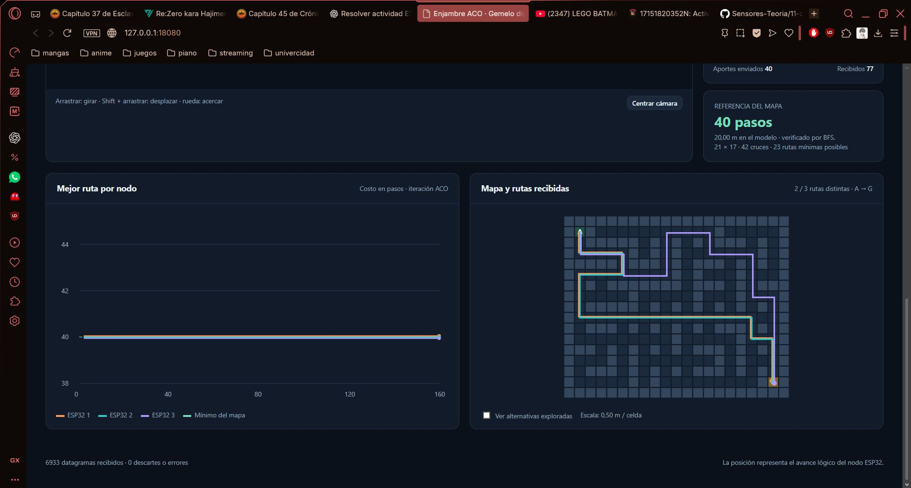

La referencia muestra 40 pasos, 20 m de modelo y 23 mínimos posibles. El mapa indica **2/3 rutas distintas**. En ese instante se ven 6933 datagramas y cero descartes o errores. La captura permite comparar calidad mínima con diversidad de selección, dos métricas que no significan lo mismo.

### Imagen 5 · Montaje de las tres ESP32

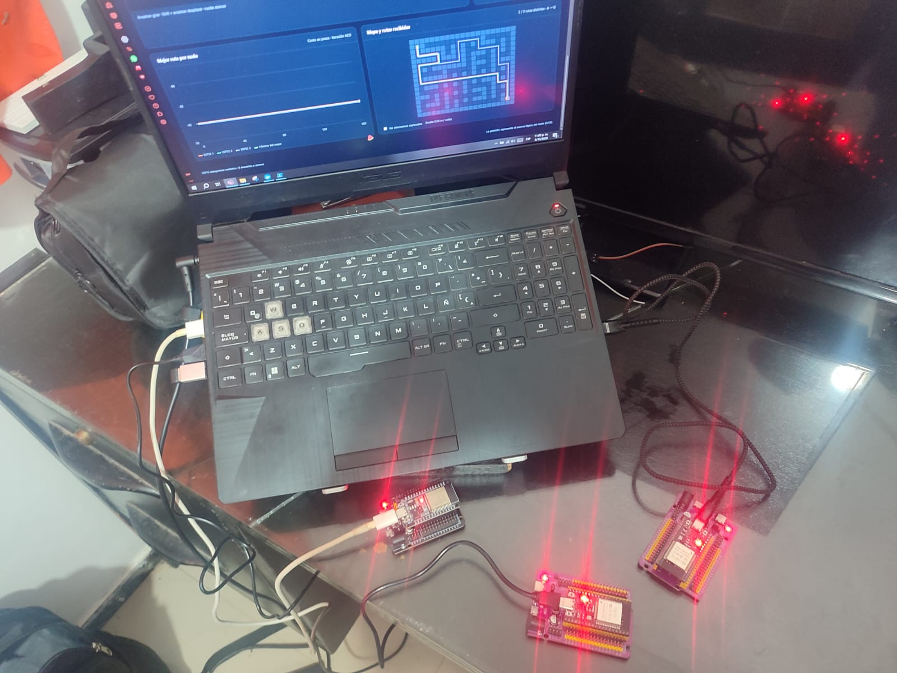

La fotografía muestra el computador y tres placas alimentadas por USB. Complementa las capturas del panel y documenta la modalidad de nodos. No muestra carritos, sensores de posición ni conexiones de motores, porque no forman parte de esta implementación.

### Imagen 6 · Referencia de la actividad


Esta imagen ya se presentó al inicio para relacionar el desarrollo con lo solicitado: tres nodos, ACO en cada placa, red AP y gemelo virtual en Docker.

### Ilustraciones de la prueba local, identificadas aparte


Estas dos vistas proceden del ensayo local documentado. No se presentan como fotografías del montaje ni como evidencia de tres rutas distintas obtenidas por las ESP32 del ensayo V3 incluido.

## 15. Problemas frecuentes y diagnóstico

| Síntoma | Qué revisar | Acción |
| --- | --- | --- |
| Thonny no encuentra COM3 | Puerto actual y cable de datos | Seleccionar COM detectado; no asumir que todas las placas usan COM3 |
| Dispositivo ocupado | `main.py` ejecutándose | Detener o `Ctrl+C`, editar y reiniciar |
| No aparece ENJAMBRE_ACO | Nodo 1 alimentado y configuración correcta | Programar AP con `NODE_ID=1`; encenderlo primero |
| Cliente no encuentra AP en 20 s | AP, SSID y contraseña | Revisar los tres `config.py` y orden de encendido |
| Panel abre con 0/3 | WiFi del computador, UDP y firewall | Conectarse al AP y revisar recepción UDP; abrir web no demuestra conexión a las placas |
| Panel dice desconectado | Edad de estados mayor de tres segundos | Revisar alimentación, WiFi, reinicios y mensajes de consola |
| 3/3 pero comando sin confirmar | ACK pendientes y datagramas | Consultar `control`; esperar reintentos y revisar nodo señalado |
| Ruta de 14 pasos o mapa rechazado | Mezcla de versión antigua y V3 | Cargar seis archivos comunes actualizados y configuración V3 en todas las placas |
| Docker recibe pero ignora | IP de proxy y `UDP_PROXY_IPS` | Revisar `last_sender`, `proxy_ips` y recrear servicio actualizado |
| Puerto ya utilizado | Otro Docker o Python directo | Cerrar la otra instancia; no lanzar dos receptores 4211 |
| Docker build falla sin internet | Descarga de base y dependencias | Construir conectado a internet antes de entrar al AP |
| Paquete de PyBullet no instala fuera de Docker | Versión Python y entorno | Usar entorno Python 3.11 como Docker; no reutilizar venv de otra tarea |
| Robots quietos en A | Fase `SEARCHING` o pausa | Esperar selección y verificar `running`; no se mueve durante búsqueda |
| Dos rutas aunque haya 23 posibles | Planes conocidos, plazo y alternativas | Revisar contador real; repetir ensayo puede cambiar resultado, sin garantizar tres |
| Render detenido | `renderer_running`, `/health`, logs | Consultar error y recrear servicio después de resolverlo |

### Comandos útiles en PowerShell

Comprobar interfaz y alcance al AP:

```powershell
ipconfig
ping 192.168.4.1
```

`ping` comprueba conectividad IP, no recepción de UDP. Para consultar el servicio:

```powershell
docker compose ps
docker compose logs --tail 80 gemelo
Invoke-RestMethod http://127.0.0.1:18080/health
```

Revisar diagnóstico UDP:

```powershell
(Invoke-RestMethod http://127.0.0.1:18080/api/state).udp | Format-List
```

- `received`: datagramas que alcanzaron el socket, antes de validar remitente.
- `ignored`: remitentes no permitidos, contador separado de errores del almacén.
- `last_sender`: última IP y puerto observados.
- `proxy_ips`: puertas de enlace o IP explícitas permitidas.
- `reply_port`: puerto anunciado al AP para devolver datos.

Revisar confirmaciones y estados:

```powershell
(Invoke-RestMethod http://127.0.0.1:18080/api/state).control | Format-List
(Invoke-RestMethod http://127.0.0.1:18080/api/state).nodes |
    Select-Object src, online, phase, running, iteration, best_cost, shared_tx, shared_rx
```

Para mostrar tráfico con Wireshark, captura la interfaz WiFi conectada al AP y aplica:

```text
udp.port == 4210 || udp.port == 4211
```

Revisa `ph`, `plan`, `state`, `cmd` y `ack`. No hay captura Wireshark incluida, así que este procedimiento es una guía de comprobación, no un resultado ya demostrado por las fotografías.

## 16. Pruebas de software y límites de la verificación

El proyecto incluye **18 pruebas originales**. [`docs/PRUEBAS.md`](docs/PRUEBAS.md) conserva el informe de su ejecución previa y distingue la prueba local de los archivos del montaje. Para repetir la suite completa con las dependencias instaladas:

```powershell
.\.venv\Scripts\python.exe -m unittest discover -s tests -v
```

Se espera `Ran 18 tests` y `OK` si todas pasan en ese entorno.

Durante esta revisión documental se ejecutaron **16 de las 18 pruebas: todas aprobadas, en 31,597 s**. Se comprobaron 100 semillas de ACO, mapa y mínimos, feromona y duplicados, pausa/reinicio, planes, elección con pérdida de mensaje, tamaño UDP, transporte local y comportamiento del proxy. **No se volvieron a ejecutar las dos pruebas que necesitan PyBullet**, `test_render_and_no_wall_intersection` y `test_http_control_three_nodes_and_export`, porque esta revisión no disponía del módulo. El informe anterior de 18 aprobadas no se presenta como una nueva ejecución completa.

No se hicieron nuevas mediciones en ESP32 ni se ejecutó Docker Desktop del usuario. Los resultados del montaje proceden de sus seis imágenes y CSV adjuntos. También se comprobó que las tareas 4, 5 y 6 de la entrega conservaran exactamente los archivos del repositorio y que sus carpetas no cambiaran de nombre.

La comprobación de calidad del grafo se refiere al mapa conocido. La ausencia de intersecciones reportada por la prueba local corresponde a poses muestreadas y cuerpos cinemáticos, no a una garantía de ausencia de choque entre carritos físicos.

## 17. Conclusiones y mejoras pendientes

**Sobre O1 y O2.** Pude relacionar el montaje de tres placas con la búsqueda reportada por cada nodo. Los tres completaron 160 iteraciones y 1280 candidatas, y el panel recibió telemetría de todos. Aprendí que tener una página abierta no basta para demostrar comunicación: fue necesario revisar WiFi del computador, puertos UDP y los estados recientes.

**Sobre O3.** Comprobé aportes enviados y recibidos en las tres placas. La cooperación permite incorporar soluciones ajenas sin trasladar ACO al computador. Los contadores distintos de recepción me muestran que debo considerar la naturaleza de UDP y no afirmar entrega perfecta solo porque el panel no registra errores.

**Sobre O4 y O7.** Los tres nodos reportaron 40 pasos, igual al mínimo calculado. Sin embargo, el montaje registró dos rutas distintas, por lo que no puedo concluir que toda ejecución produzca tres caminos diferentes. Entendí que calidad de una ruta y diversidad del enjambre son resultados separados. Como mejora revisaría los tiempos y la sincronización de los planes con registros completos de cada elección.

**Sobre O5.** Logré vincular el avance reportado con robots virtuales en un escenario PyBullet. La interpolación sobre la ruta evita atajos visuales en las esquinas. Su alcance es cinemático: todavía no comprobé seguimiento mediante motores ni localización medida. Para una modalidad de carritos tendría que añadir controladores, sensores y una política de ocupación de celdas.

**Sobre O6.** El sistema conserva estado al pausar y empieza otro ensayo al reiniciar. El CSV permite revisar métricas posteriormente, pero no almacena todas las listas de rutas. Para comparar más ensayos conservaría también JSON completos y capturas de tráfico, y mediría tiempos con un procedimiento externo definido.

**Límites de los resultados.** Un ensayo y una prueba local no demuestran éxito universal del ACO. El mapa es fijo, la posición es lógica, las rutas pueden compartir tramos y no existe control de tráfico ni detección de obstáculos nuevos. Los 20 m y 26 s son valores del modelo calculados, mientras los tiempos del CSV son acumulaciones internas del firmware. Mantener esas diferencias me permite explicar lo que sí logré comprobar sin presentar la simulación como una prueba de movimiento físico.

[Volver al índice del segundo corte](../README.md) · [Explicación complementaria](docs/EXPLICACION.md) · [Pruebas y alcance](docs/PRUEBAS.md)
