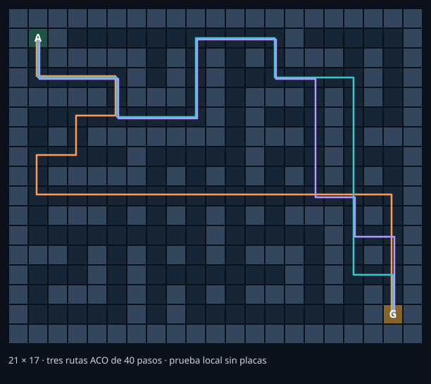
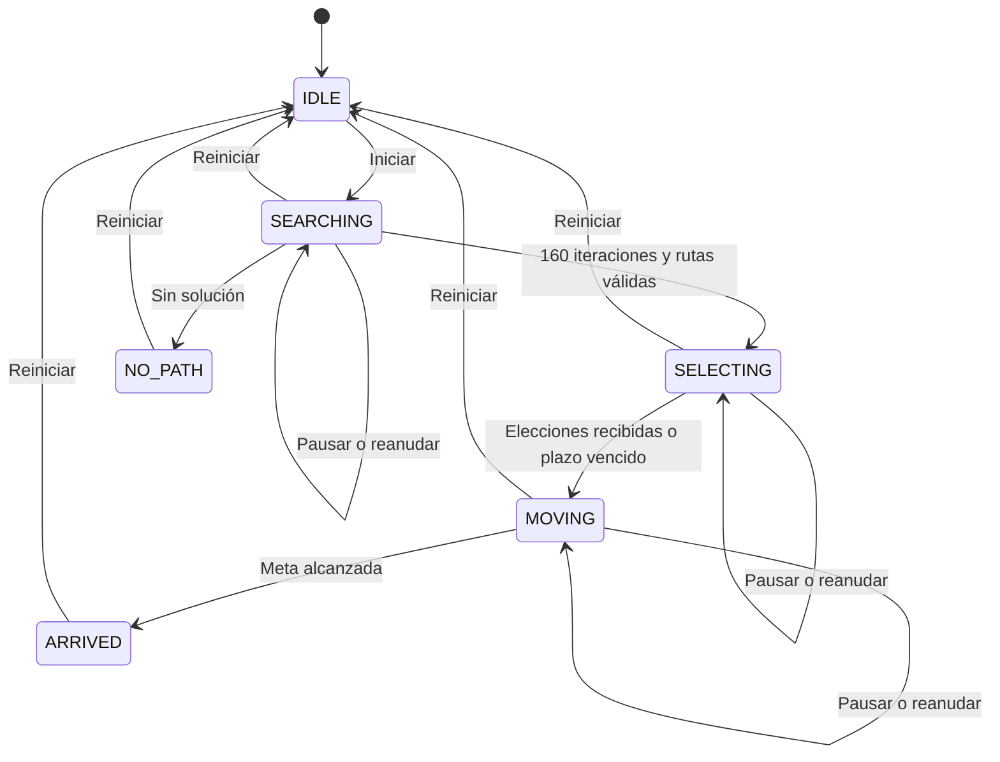

# Desarrollo y explicación de la actividad

[Volver al README detallado de la tarea 7](../README.md). Esta guía complementa la explicación de funciones, los diagramas y la galería del README; los resultados del montaje y de la prueba local se distinguen allí.

## Objetivo general

Implementar un enjambre de tres nodos ESP32 que encuentre y compare rutas de bajo costo entre una salida A y una meta G utilizando optimización por colonia de hormigas, comparta feromonas mediante una red WiFi en modo AP y permita observar su comportamiento en un gemelo digital PyBullet ejecutado en Docker.

## Objetivos específicos y comprobación

| Objetivo | Implementación | Evidencia que se debe obtener con las placas |
|---|---|---|
| Ejecutar ACO dentro de cada ESP32 | `Colony` en `aco.py`, invocada por `Agent` | Iteraciones y rutas propias en los tres nodos |
| Conectar tres nodos sin router externo | Nodo 1 AP; nodos 2 y 3 clientes | Consolas con IP y panel 3/3 |
| Compartir información del enjambre | Datagramas `ph` a través del AP | Contadores de aportes recibidos y captura UDP |
| Mostrar tres robots | `Scene`, PyBullet DIRECT y render CPU | Capturas del panel con los tres robots; esta tarea no incluye video |
| Verificar la calidad de la solución | Costo de ruta y referencia BFS en el PC | 40 pasos en el mapa entregado cuando alcanza el mínimo |
| Mantener evidencia | Registro CSV y controles confirmados | Archivo exportado y estados de llegada |

## 1. Qué significa un nodo y una hormiga

Un nodo es una placa ESP32. Una hormiga artificial es un procedimiento que construye una ruta candidata. Hay tres placas y cada una construye ocho rutas candidatas por iteración. Las hormigas son procesos del algoritmo, no seis carritos adicionales.

Cada ESP32 almacena una tabla con la feromona de cada conexión entre dos celdas vecinas. Las placas reciben aportes de sus compañeros, de modo que un descubrimiento útil puede favorecer las decisiones de todo el enjambre. El nodo 1 combina su trabajo de búsqueda con el reenvío de datagramas.

## 2. Representación del almacén

El escenario es una cuadrícula de 21 columnas y 17 filas. Una celda libre corresponde a un vértice del grafo, y una unión horizontal o vertical entre dos celdas libres corresponde a una arista. No se permite atravesar muros ni moverse en diagonal.

- Salida A: `(1, 1)`.
- Meta G: `(19, 15)`.
- Coordenadas: `(columna, fila)`, contando desde cero.
- Identificador de celda: `id = fila × 21 + columna`.
- Costo de una arista: un paso.
- Escala visual: 0,50 m por celda.
- Número de celdas transitables: 181.
- Número de aristas no dirigidas: 203.
- Cruces con tres o cuatro conexiones: 42.
- Callejones sin salida: 9.
- Ciclos independientes: 22.
- Rutas mínimas diferentes: 23, cada una de 40 pasos.



El archivo `world.py` se utiliza tanto en las placas como en el computador. Si lo modificas, cambia `MAP_ID` y vuelve a cargarlo en los tres ESP32 y en el gemelo. La comprobación de identificador detecta versiones de mapa distintas.

## 3. Elección de una ruta mediante ACO

La probabilidad de elegir una celda vecina se obtiene a partir de dos factores:

$$p_{ij}=\frac{\tau_{ij}^{\alpha}\eta_{ij}^{\beta}}{\sum_{k\in N_i}\tau_{ik}^{\alpha}\eta_{ik}^{\beta}}.$$

| Símbolo | Significado en este proyecto |
|---|---|
| $\tau_{ij}$ | Feromona de la arista entre las celdas $i$ y $j$ |
| $\eta_{ij}$ | Conveniencia heurística de ir hacia $j$ |
| $\alpha$ | Influencia de la feromona; valor inicial 1 |
| $\beta$ | Influencia de la heurística; valor inicial 2 |
| $N_i$ | Vecinos libres aún no explorados por esa hormiga |

La forma de probabilidad y la actualización por evaporación proceden del marco ACO [1]. La heurística elegida aquí es una adaptación a este problema de búsqueda de caminos:

$$\eta_{ij}=\frac{1}{1+|x_G-x_j|+|y_G-y_j|}.$$

Cuanto menor sea la distancia Manhattan de la celda candidata a la meta, mayor será su valor heurístico. Las conexiones de esta cuadrícula tienen igual longitud, por lo que utilizar únicamente el inverso de la longitud de cada arista no distinguiría las direcciones.

Por ejemplo, si dos alternativas tienen pesos 0,20 y 0,10, sus probabilidades normalizadas son 2/3 y 1/3. La opción con mayor peso suele elegirse más, pero sigue existiendo posibilidad de explorar la otra.

Un 25 % de las decisiones elige un vecino al azar. Esto mantiene exploración. Si una hormiga entra en un callejón sin salida, retrocede hasta encontrar otra alternativa. El retroceso se elimina de la ruta final; una hormiga no explora indefinidamente las mismas celdas.

## 4. Evaporación y depósito

Al iniciar una iteración se evapora la feromona:

$$\tau_{ij}\leftarrow\max\{\tau_{\min},(1-\rho)\tau_{ij}\},\qquad\rho=0.12.$$

Cada ruta válida deposita una cantidad inversamente proporcional a su costo:

$$\Delta\tau_{ij}=\frac{Q}{L},\qquad Q=4.$$

Aquí $L$ es el número de pasos de la ruta. Las aristas que no pertenecen a esa ruta reciben cero de esa hormiga. Al terminar la iteración se refuerza de forma rotativa una de las alternativas del mejor costo con un aporte adicional $0.5Q/L$. Los valores se limitan al intervalo $[0.05,20]$.

| Ruta | Costo $L$ | Depósito por arista $Q/L$ |
|---|---:|---:|
| Ruta mínima | 40 pasos | 0,1000 |
| Ruta más larga | 44 pasos | 0,0909 |

Una ruta más corta recibe un depósito mayor, lo cual incrementa su influencia en decisiones posteriores. La evaporación permite que las preferencias cambien. Las placas pueden tener tablas distintas porque reciben mensajes en momentos diferentes y cada una añade sus propios aportes.

## 5. Qué se comparte por WiFi

Cada cuatro iteraciones, el nodo comparte una ruta de su archivo de alternativas y su depósito $Q/L$. Recorre el archivo en forma rotativa para que sus compañeros conozcan soluciones distintas. Esto equivale a compartir un aporte de feromona sobre las aristas de esa ruta, sin enviar una matriz completa.

Ejemplo de contenido de un mensaje:

```json
{
  "v": 1,
  "map": "almacen-21x17-multirruta-v3",
  "type": "ph",
  "src": 2,
  "boot": "ejemplo-nodo-2",
  "seq": 100,
  "epoch": "ensayo-ejemplo",
  "path": [
    22,
    43,
    64,
    65,
    66,
    67,
    68,
    89,
    110,
    111,
    112,
    113,
    114,
    93,
    72,
    51,
    30,
    31,
    32,
    33,
    34,
    55,
    76,
    77,
    78,
    79,
    80,
    101,
    122,
    143,
    164,
    185,
    206,
    227,
    248,
    269,
    290,
    291,
    292,
    313,
    334
  ],
  "amount": 0.1
}
```

El datagrama real incluye también versión, identificador de mapa, sesión de arranque y secuencia. Al recibirlo, otra placa verifica la ruta, añade el aporte y conserva la solución recibida si mejora su mejor costo. El costo encontrado de forma local se reporta por separado como `local_cost`.

El receptor evita aplicar dos veces un mismo mensaje mediante una caché acotada de secuencias recientes. Un identificador de ensayo impide mezclar feromonas de antes y después de un reinicio. UDP puede perder paquetes; el sistema continúa con los aportes que recibe. Los comandos de usuario tienen confirmación y reintentos; los aportes de feromona no se retransmiten.

## 5.1. Conservar y elegir alternativas

La versión V3 guarda hasta 12 rutas distintas, priorizadas por costo y obtenidas por las hormigas o recibidas de los otros nodos. Al construir ocho candidatas en cada una de las 160 iteraciones, cada placa evalúa 1280 rutas. El refuerzo adicional rota entre las alternativas de menor costo para reducir el predominio de una sola solución.

Antes de moverse, las placas intercambian mensajes `plan` con la ruta que eligieron:

| Nodo | Elección |
|---|---|
| 1 | Elige entre las rutas del menor costo encontrado |
| 2 | Considera la elección del nodo 1 y evita repetirla si conoce otra del mismo costo |
| 3 | Considera las elecciones de los nodos 1 y 2 y evita repetirlas si conoce otra del mismo costo |

Entre alternativas disponibles se favorece compartir menos aristas con las elecciones anteriores. Ninguna placa recibe una ruta prefijada desde el computador. Todas las opciones proceden de ACO o de otro ESP32. Los mensajes de elección se repiten y el AP guarda los últimos para incorporaciones tardías. Si faltan nodos se continúa al vencer el plazo de espera; el panel cuenta las rutas realmente distintas, sin asumir que siempre serán tres.

Esta coordinación permite comparar alternativas; no reserva las celdas en el tiempo y no constituye un sistema para evitar choques físicos. El archivo de alternativas y la elección por prioridad son ampliaciones propias de esta implementación, sobre el ACO descrito en [1].

## 6. Estados del nodo



Pausar conserva la fase y el estado interno, con `running=false`. Reanudar vuelve a activar el avance. Reiniciar crea un ensayo nuevo, limpia las elecciones y restaura el algoritmo. La semilla se mezcla con el nuevo identificador de ensayo; esto cambia la exploración, aunque puede volver a encontrarse una misma solución.

Durante la búsqueda, el robot permanece en A y el panel muestra el mejor costo encontrado. Al completar las iteraciones, se elige una alternativa considerando las elecciones de los compañeros. Se espera al menos 600 ms después de anunciarla y se inicia el recorrido al recibir las demás elecciones, o al vencer un plazo de 4 s. El nodo calcula su avance a lo largo de esa ruta y envía el estado aproximadamente cinco veces por segundo. La ruta del recorrido se mantiene fija hasta llegar a la meta; un aporte posterior puede mejorar el conocimiento almacenado, pero no cambia el trayecto a mitad de un segmento.

## 7. Gemelo digital y Docker

PyBullet crea el suelo, los muros y tres robots de colores distintos. El proceso de recepción obtiene los estados por UDP y el proceso de visualización coloca cada robot a lo largo de su ruta recibida. Se interpola el avance sobre los segmentos del camino, para que una actualización perdida no haga que el robot atraviese una esquina.

Se usa el modo `DIRECT` y el renderizador de CPU de PyBullet [3]. Por ello, Docker no necesita abrir una ventana OpenGL ni recibir acceso a la pantalla del computador. El navegador muestra los fotogramas producidos por PyBullet y permite manejar la cámara y el ensayo.

El contenedor utiliza `8080/TCP` internamente y lo publica como `127.0.0.1:18080` en Windows. Publica también `4211/UDP` para la telemetría [4]. Las carpetas `firmware` y `simulador` se montan con acceso de lectura: el gemelo y las placas usan el mismo mapa. El computador se une al AP como los otros nodos. El ESP32 responde a la IP desde la cual recibe la suscripción y al puerto publicado anunciado por el gemelo.

Los robots son cuerpos cinemáticos: su pose está determinada por el estado reportado. La escala del mapa es ilustrativa. En la modalidad de nodos, el avance es lógico; para representar un carrito real debe reemplazarse por posición medida y control de motores.

## 8. Resultado de referencia

BFS verifica en el computador que el mínimo del grafo es **40 pasos** y que existen **23 rutas mínimas distintas**. Corresponden a 20 m en la escala ilustrativa de 0,50 m por celda. La distancia Manhattan entre A y G es 32 pasos, pero los muros obligan a un desvío: esa cota por sí sola no resuelve el nuevo mapa.

En la prueba local con tres agentes sobre sockets UDP se recibieron tres rutas distintas de 40 pasos. Las rutas completas, las métricas y el alcance de la prueba están en `resultados_prueba_local.json` y `PRUEBAS.md`. El diagrama `mapa.svg` muestra esas rutas ACO, no una asignación calculada por BFS para las placas.

La referencia BFS sirve para comprobar los resultados y no transmite rutas a los ESP32. ACO es estocástico: la calidad de cada ensayo se verifica comparando el costo recibido con el mínimo. La entrega incluye ahora capturas del montaje V3: los tres nodos llegaron con 40 pasos y el panel contó dos rutas distintas. Esa evidencia no debe confundirse con las tres rutas de la prueba local. Las imágenes se muestran y analizan en el README principal de esta tarea.

Los datagramas usan JSON compacto [5] y están limitados a 1400 bytes. Cuando la ruta del recorrido coincide con la mejor ruta, se transmite una sola lista con `route_same=true`; el receptor reconstruye ambas listas. Se comprobaron rutas largas, planes inválidos, versiones de mapa incompatibles y posiciones que cruzarían muros.

## 9. Guion de demostración

1. Mostrar las tres placas y explicar que cada una contiene `aco.py`.
2. Mostrar que el ESP32 1 genera ENJAMBRE_ACO y que las otras dos placas y el computador se conectan.
3. Abrir el panel y comprobar los tres nodos activos.
4. Pulsar Iniciar y observar las 160 iteraciones, las candidatas evaluadas y los aportes compartidos.
5. Activar Ver alternativas exploradas, observar las elecciones y comprobar el número de rutas diferentes recibidas. Seguir los tres robots hasta G.
6. Comparar el costo recibido con el mínimo de 40 pasos.
7. Pausar/reanudar un ensayo y demostrar que el estado se conserva.
8. Exportar el CSV y mostrar los mensajes `ph` y `plan` en Wireshark, si el profesor pide evidencia de comunicación.

## Referencias

[1] M. Dorigo y T. Stützle, «The Ant Colony Optimization Metaheuristic: Algorithms, Applications, and Advances», 2002. Documento de los autores: https://iridia.ulb.ac.be/~mdorigo/Published_papers/2002/DorStu2002MetaHandBook.pdf

[2] MicroPython, «class WLAN – control built-in WiFi interfaces», documentación v1.26.0. https://docs.micropython.org/en/v1.26.0/library/network.WLAN.html

[3] E. Coumans y Y. Bai, «PyBullet Quickstart Guide», repositorio oficial Bullet Physics. https://github.com/bulletphysics/bullet3/blob/master/docs/pybullet_quickstart_guide/PyBulletQuickstartGuide.md.html

[4] Docker, «Define services in Docker Compose», sección ports. https://docs.docker.com/reference/compose-file/services/#ports

[5] MicroPython, «json — JSON encoding and decoding», documentación v1.26.0. https://docs.micropython.org/en/v1.26.0/library/json.html

Consulta de documentación: octubre de 2026. La heurística Manhattan, el transporte por aportes y los parámetros concretos son decisiones de implementación de este proyecto.
