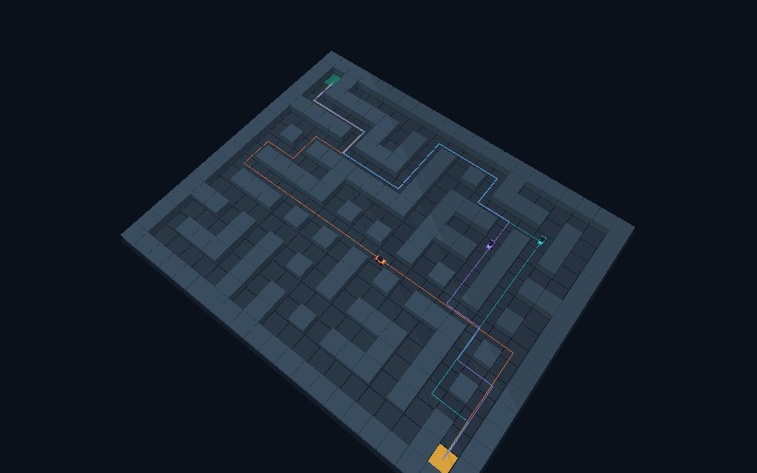

# Verificación de software — V3 multirruta

Verificación: 6 de octubre de 2026 (UTC).

**Resultado del informe original: 18 pruebas automáticas aprobadas en 42,75 s.** Se ejecutaron con CPython, PyBullet 3.2.7, NumPy 1.26.4 y Pillow 11.3.0. El ACO, los agentes, el protocolo y el transporte usados por las pruebas son los mismos archivos que se cargan en las placas.

## Resultado del nuevo mapa

| Propiedad | Resultado comprobado |
|---|---:|
| Dimensiones | 21 × 17 |
| Celdas transitables | 181 |
| Aristas del grafo | 203 |
| Cruces de tres o cuatro conexiones | 42 |
| Callejones sin salida | 9 |
| Ciclos independientes | 22 |
| Mínimo verificado por BFS | 40 pasos |
| Rutas mínimas diferentes | 23 |

El contador de BFS se contrastó con una enumeración independiente de las rutas mínimas. Las 23 rutas son válidas, distintas y de 40 pasos.

## Qué comprobaron las 18 pruebas

| Grupo | Comprobación | Resultado |
|---|---|---|
| ACO, 100 semillas | Ocho hormigas y 160 iteraciones por semilla; costos distintos durante la exploración | 100/100 llegaron a 40 pasos; rutas válidas y feromonas acotadas |
| Aportes de feromona | Duplicados, ensayo anterior, muros y NaN | Aportes correctos aceptados; los demás rechazados |
| Control del nodo | Pausa, reanudación, reinicio, comandos antiguos y llegada | Estado conservado al pausar y limpiado al reiniciar |
| UDP real local | Tres agentes, reenvío por AP, intercambio, elección y recorrido | Tres rutas distintas de 40 pasos |
| Pérdida de comando e incorporación tardía | Reintento y sincronización del nodo que se incorpora después | Tres confirmaciones y llegada |
| Validación de telemetría | Secuencia repetida y posición incompatible con la ruta | Rechazadas |
| PyBullet | Render, cámara y muros sobre poses muestreadas | JPEG válido y cero intersecciones |
| HTTP | Panel, API, Iniciar, tres confirmaciones, rutas, salud y CSV | Respuestas correctas; API con tres rutas y 23 mínimos posibles |
| Proxy de Docker | Otra IP y dos puertos de origen alternados | Tres rutas distintas; JSON inválido rechazado |
| Remitente directo | IP ajena y puerto incorrecto del AP | Rechazados; el AP correcto se acepta |
| Proxy, detección automática | Tabla de rutas Linux y métricas | Gateway predeterminado correcto |
| Proxy, configuración explícita | Lista de IP, configuración vacía y valores inválidos | Validación correcta |
| Proxy sin gateway | Archivo ausente o sin ruta predeterminada | Error explicativo |
| Topología multirruta | Enumeración independiente de rutas mínimas | 23 rutas reales de 40 pasos |
| Elección coordinada | Pérdida del primer plan y pausa durante la selección | Tres alternativas distintas, con 1280 candidatas por nodo |
| Planes inválidos | Plan viejo, reordenado, costo erróneo, ruta inválida y mapa anterior | Rechazados |
| Presupuesto UDP | 200 rutas, incluidas rutas largas y listas compactadas | Mensajes dentro de 1400 bytes; estado reconstruido sin cambios |
| Nuevo ensayo | Semilla de exploración y limpieza de elecciones | Semilla cambia y se borran rutas y planes |

Se comprobó la sintaxis JavaScript con `node --check`. También se ejecutó el flujo del panel con un DOM simulado y el estado real de la prueba UDP: se verificaron métricas, escala del gráfico, coordenadas finitas y activación de alternativas. Esta comprobación no sustituye la interacción en un navegador real del computador del montaje.

## Ensayo local registrado

Los archivos de evidencia se generaron con tres agentes CPython comunicándose sobre sockets UDP reales de loopback. **No corresponden a placas ESP32 conectadas.** Se conservaron las 160 iteraciones y ocho hormigas; para acelerar la comprobación se usaron 4 ms por iteración y 12 ms por arista. Los archivos `config.py` de las placas mantienen 100 ms por iteración y 650 ms por arista.

| Nodo local | Iteraciones | Pasos | Candidatas | Alternativas del menor costo | Aportes enviados | Recibidos | Estado |
|---|---:|---:|---:|---:|---:|---:|---|
| 1 | 160 | 40 | 1280 | 12 | 40 | 80 | ARRIVED |
| 2 | 160 | 40 | 1280 | 12 | 40 | 80 | ARRIVED |
| 3 | 160 | 40 | 1280 | 12 | 40 | 80 | ARRIVED |

- Rutas de recorrido diferentes: **3**.
- Errores del receptor: **0**.
- Intersecciones con muros: **0**, comprobadas en 161 posiciones de cada una de las tres rutas recibidas.
- `resultados_prueba_local.json`: rutas, costos, métricas, estado y alcance del ensayo.
- `telemetria_prueba_local.csv`: telemetría recibida; columna `source=PRUEBA_LOCAL`.
- `mapa.svg`: mapa exacto con las tres rutas recibidas.
- `vista_pybullet_prueba_local.png`: vista generada a partir de esas rutas y poses muestreadas al 65 % de su avance. Es una ilustración de la prueba local.



## Evidencia del montaje incorporada a la entrega

El archivo recibido incluye seis imágenes en `../evidencias/` y dos registros en `../data/`. El [README de la tarea](../README.md#13-resultados-y-análisis-de-las-gráficas) presenta los resultados y la [galería completa](../README.md#14-evidencias-en-imágenes).

En la captura `3.JPG`, los tres ESP32 aparecen en la meta con 40 pasos, 160 iteraciones, 1280 candidatas y 12 alternativas mínimas por nodo. En `4.JPG`, el panel cuenta **2/3 rutas distintas**, con 6933 datagramas y cero errores en ese instante. La fotografía `5.jpeg` muestra las tres placas alimentadas por USB. El CSV V3 contiene 7982 filas y reporta tiempos activos finales de 66513, 69893 y 70126 ms. La imagen `2.JPG` muestra nodos sin telemetría reciente y se identifica como diagnóstico.

Estas evidencias del montaje no sustituyen ni cambian el ensayo local anterior: aquel obtuvo tres rutas distintas con agentes CPython. No hay video, captura Wireshark ni medición de desplazamiento físico. Las posiciones siguen siendo lógicas y los robots son cinemáticos.

## Verificación durante esta revisión documental

Se ejecutaron **16 de las 18 pruebas existentes**, todas aprobadas en **31,597 s**. Incluyen ACO en 100 semillas, mapa y mínimos, control del agente, feromonas, planes, presupuesto JSON, transporte UDP local, reintentos y proxy. No se ejecutaron nuevamente `test_render_and_no_wall_intersection` ni `test_http_control_three_nodes_and_export`, porque el módulo PyBullet no estaba disponible en el entorno de revisión. El informe original de 18 aprobadas se conserva como antecedente y no como una nueva ejecución completa.

No se hicieron nuevas pruebas en las placas ni en Docker Desktop del montaje. Se verificó la documentación contra el código, las imágenes y los CSV originales, y se revisaron enlaces y preservación de las tareas anteriores.

## Cómo repetir

Desde la raíz del proyecto, con `requirements.txt` instalado:

```powershell
.\.venv\Scripts\python.exe -m unittest discover -s tests -v
```

Se espera `Ran 18 tests` seguido de `OK`. Para evidencia del montaje, utiliza `LEEME_ACTUALIZACION_V3.txt` y exporta un CSV nuevo desde el panel conectado a las placas.
